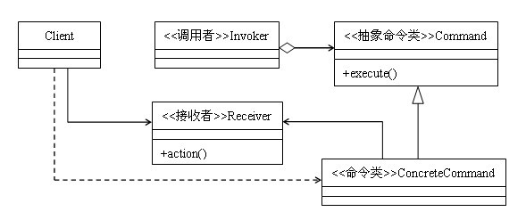

定义：将一个请求封装成一个对象，从而让你使用不同的请求把客户端参数化，对请求排队或者记录请求日志，可以提供命令的撤销和恢复功能。
类型：行为类模式
类图：



## 1. 命令模式的结构

顾名思义，命令模式就是对命令的封装，首先来看一下命令模式类图中的基本结构：

- Command类：是一个抽象类，类中对需要执行的命令进行声明，一般来说要对外公布一个execute方法用来执行命令
- ConcreteCommand类：Command类的实现类，对抽象类中声明的方法进行实现
- Client类：最终的客户端调用类

以上三个类的作用应该是比较好理解的，下面我们重点说一下Invoker类和Recevier类。

- Invoker类：调用者，负责调用命令
- Receiver类：接收者，负责接收命令并且执行命令

所谓对命令的封装，说白了，无非就是把一系列的操作写到一个方法中，然后供客户端调用就行了，反映到类图上，只需要一个ConcreteCommand类和Client类就可以完成对命令的封装，即使再进一步，为了增加灵活性，可以再增加一个Command类进行适当地抽象，这个调用者和接收者到底是什么作用呢？

其实大家可以换一个角度去想：假如仅仅是简单地把一些操作封装起来作为一条命令供别人调用，怎么能称为一种模式呢？命令模式作为一种行为类模式，首先要做到低耦合，耦合度低了才能提高灵活性，而加入调用者和接收者两个角色的目的也正是为此。命令模式的通用代码如下：

```java
class Invoker {  
    private Command command;  
    public void setCommand(Command command) {  
        this.command = command;  
    }  
    public void action(){  
        this.command.execute();  
    }  
}  

abstract class Command {  
    public abstract void execute();  
}  

class ConcreteCommand extends Command {  
    private Receiver receiver;  
    public ConcreteCommand(Receiver receiver){  
        this.receiver = receiver;  
    }  
    public void execute() {  
        this.receiver.doSomething();  
    }  
}  

class Receiver {  
    public void doSomething(){  
        System.out.println("接受者-业务逻辑处理");  
    }  
}  

public class Client {  
    public static void main(String[] args){  
        Receiver receiver = new Receiver();  
        Command command = new ConcreteCommand(receiver);  
        //客户端直接执行具体命令方式（此方式与类图相符）  
        command.execute();  

        //客户端通过调用者来执行命令  
        Invoker invoker = new Invoker();  
        invoker.setCommand(command);  
        invoker.action();  
    }  
}  
```
通过代码我们可以看到，当我们调用时，执行的时序首先是调用者类，然后是命令类，最后是接收者类。也就是说一条命令的执行被分成了三步，它的耦合度要比把所有的操作都封装到一个类中要低的多，而这也正是命令模式的精髓所在：把命令的调用者与执行者分开，使双方不必关心对方是如何操作的。

## 2. 命令模式的优缺点
首先，命令模式的封装性很好：每个命令都被封装起来，对于客户端来说，需要什么功能就去调用相应的命令，而无需知道命令具体是怎么执行的。比如有一组文件操作的命令：新建文件、复制文件、删除文件。如果把这三个操作都封装成一个命令类，客户端只需要知道有这三个命令类即可，至于命令类中封装好的逻辑，客户端则无需知道。

其次，命令模式的扩展性很好，在命令模式中，在接收者类中一般会对操作进行最基本的封装，命令类则通过对这些基本的操作进行二次封装，当增加新命令的时候，对命令类的编写一般不是从零开始的，有大量的接收者类可供调用，也有大量的命令类可供调用，代码的复用性很好。比如，文件的操作中，我们需要增加一个剪切文件的命令，则只需要把复制文件和删除文件这两个命令组合一下就行了，非常方便。

最后说一下命令模式的缺点，那就是命令如果很多，开发起来就要头疼了。特别是很多简单的命令，实现起来就几行代码的事，而使用命令模式的话，不用管命令多简单，都需要写一个命令类来封装。

## 3. 命令模式的适用场景
对于大多数请求-响应模式的功能，比较适合使用命令模式，正如命令模式定义说的那样，命令模式对实现记录日志、撤销操作等功能比较方便。

## 4. 总结

对于一个场合到底用不用模式，这对所有的开发人员来说都是一个很纠结的问题。有时候，因为预见到需求上会发生的某些变化，为了系统的灵活性和可扩展性而使用了某种设计模式，但这个预见的需求偏偏没有，相反，没预见到的需求倒是来了不少，导致在修改代码的时候，使用的设计模式反而起了相反的作用，以至于整个项目组怨声载道。这样的例子，我相信每个程序设计者都遇到过。所以，基于敏捷开发的原则，我们在设计程序的时候，如果按照目前的需求，不使用某种模式也能很好地解决，那么我们就不要引入它，因为要引入一种设计模式并不困难，我们大可以在真正需要用到的时候再对系统进行一下，引入这个设计模式。

拿命令模式来说吧，我们开发中，请求-响应模式的功能非常常见，一般来说，我们会把对请求的响应操作封装到一个方法中，这个封装的方法可以称之为命令，但不是命令模式。到底要不要把这种设计上升到模式的高度就要另行考虑了，因为，如果使用命令模式，就要引入调用者、接收者两个角色，原本放在一处的逻辑分散到了三个类中，设计时，必须考虑这样的代价是否值得。
