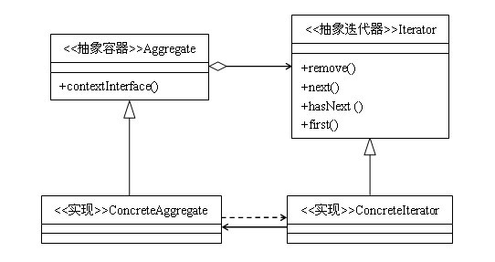

定义：提供一种方法访问一个容器对象中各个元素，而又不暴露该对象的内部细节。
类型：行为类模式
类图：



如果要问Java中使用最多的一种模式，答案不是单例模式，也不是工厂模式，更不是策略模式，而是迭代器模式，先来看一段代码吧：

```java
public static void print(Collection coll){  
    Iterator it = coll.iterator();  
    while(it.hasNext()){  
        String str = (String)it.next();  
        System.out.println(str);  
    }  
}  
```
这个方法的作用是循环打印一个字符串集合，里面就用到了迭代器模式，java语言已经完整地实现了迭代器模式，Iterator翻译成汉语就是迭代器的意思。提到迭代器，首先它是与集合相关的，集合也叫聚集、容器等，我们可以将集合看成是一个可以包容对象的容器，例如List，Set，Map，甚至数组都可以叫做集合，而迭代器的作用就是把容器中的对象一个一个地遍历出来。

## 1. 迭代器模式的结构

- 抽象容器：一般是一个接口，提供一个iterator()方法，例如java中的Collection接口，List接口，Set接口等。
- 具体容器：就是抽象容器的具体实现类，比如List接口的有序列表实现ArrayList，List接口的链表实现LinkList，Set接口的哈希列表的实现HashSet等。
- 抽象迭代器：定义遍历元素所需要的方法，一般来说会有这么三个方法：取得第一个元素的方法first()，取得下一个元素的方法next()，判断是否遍历结束的方法isDone()（或者叫hasNext()），移出当前对象的方法remove(),
- 迭代器实现：实现迭代器接口中定义的方法，完成集合的迭代。

代码实现

```java
interface Iterator {  
    public Object next();  
    public boolean hasNext();  
}  
class ConcreteIterator implements Iterator{  
    private List list = new ArrayList();  
    private int cursor =0;  
    public ConcreteIterator(List list){  
        this.list = list;  
    }  
    public boolean hasNext() {  
        if(cursor==list.size()){  
            return false;  
        }  
        return true;  
    }  
    public Object next() {  
        Object obj = null;  
        if(this.hasNext()){  
            obj = this.list.get(cursor++);  
        }  
        return obj;  
    }  
}  
interface Aggregate {  
    public void add(Object obj);  
    public void remove(Object obj);  
    public Iterator iterator();  
}  
class ConcreteAggregate implements Aggregate {  
    private List list = new ArrayList();  
    public void add(Object obj) {  
        list.add(obj);  
    }  

    public Iterator iterator() {  
        return new ConcreteIterator(list);  
    }  

    public void remove(Object obj) {  
        list.remove(obj);  
    }  
}  
public class Client {  
    public static void main(String[] args){  
        Aggregate ag = new ConcreteAggregate();  
        ag.add("小明");  
        ag.add("小红");  
        ag.add("小刚");  
        Iterator it = ag.iterator();  
        while(it.hasNext()){  
            String str = (String)it.next();  
            System.out.println(str);  
        }  
    }  
}  
```

上面的代码中，Aggregate是容器类接口，大家可以想象一下Collection，List，Set等，Aggregate就是他们的简化版，容器类接口中主要有三个方法：添加对象方法add、删除对象方法remove、取得迭代器方法iterator。Iterator是迭代器接口，主要有两个方法：取得迭代对象方法next，判断是否迭代完成方法hasNext，大家可以对比java.util.List和java.util.Iterator两个接口自行思考。

## 2. 迭代器模式的优缺点

### 2.1 迭代器模式的优点

简化了遍历方式，对于对象集合的遍历，还是比较麻烦的，对于数组或者有序列表，我们尚可以通过游标来取得，但用户需要在对集合了解很清楚的前提下，自行遍历对象，但是对于hash表来说，用户遍历起来就比较麻烦了。而引入了迭代器方法后，用户用起来就简单的多了。

可以提供多种遍历方式，比如说对有序列表，我们可以根据需要提供正序遍历，倒序遍历两种迭代器，用户用起来只需要得到我们实现好的迭代器，就可以方便的对集合进行遍历了。

封装性良好，用户只需要得到迭代器就可以遍历，而对于遍历算法则不用去关心。

### 2.2 迭代器模式的缺点

对于比较简单的遍历（像数组或者有序列表），使用迭代器方式遍历较为繁琐，大家可能都有感觉，像ArrayList，我们宁可愿意使用for循环和get方法来遍历集合。

## 3. 迭代器模式的适用场景

迭代器模式是与集合共生共死的，一般来说，我们只要实现一个集合，就需要同时提供这个集合的迭代器，就像java中的Collection，List、Set、Map等，这些集合都有自己的迭代器。假如我们要实现一个这样的新的容器，当然也需要引入迭代器模式，给我们的容器实现一个迭代器。

但是，由于容器与迭代器的关系太密切了，所以大多数语言在实现容器的时候都给提供了迭代器，并且这些语言提供的容器和迭代器在绝大多数情况下就可以满足我们的需要，所以现在需要我们自己去实践迭代器模式的场景还是比较少见的，我们只需要使用语言中已有的容器和迭代器就可以了。
