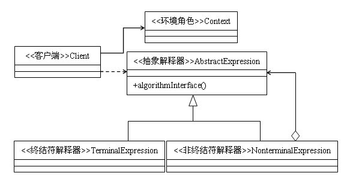

定义：给定一种语言，定义他的文法的一种表示，并定义一个解释器，该解释器使用该表示来解释语言中句子。
类型：行为类模式
类图：



解释器模式是一个比较少用的模式，本人之前也没有用过这个模式。下面我们就来一起看一下解释器模式。

## 解释器模式的结构

抽象解释器：声明一个所有具体表达式都要实现的抽象接口（或者抽象类），接口中主要是一个interpret()方法，称为解释操作。具体解释任务由它的各个实现类来完成，具体的解释器分别由终结符解释器TerminalExpression和非终结符解释器NonterminalExpression完成。

终结符表达式：实现与文法中的元素相关联的解释操作，通常一个解释器模式中只有一个终结符表达式，但有多个实例，对应不同的终结符。终结符一半是文法中的运算单元，比如有一个简单的公式R=R1+R2，在里面R1和R2就是终结符，对应的解析R1和R2的解释器就是终结符表达式。

非终结符表达式：文法中的每条规则对应于一个非终结符表达式，非终结符表达式一般是文法中的运算符或者其他关键字，比如公式R=R1+R2中，+就是非终结符，解析+的解释器就是一个非终结符表达式。非终结符表达式根据逻辑的复杂程度而增加，原则上每个文法规则都对应一个非终结符表达式。

环境角色：这个角色的任务一般是用来存放文法中各个终结符所对应的具体值，比如R=R1+R2，我们给R1赋值100，给R2赋值200。这些信息需要存放到环境角色中，很多情况下我们使用Map来充当环境角色就足够了。

代码实现

```java
class Context {}  
abstract class Expression {  
    public abstract Object interpreter(Context ctx);  
}  
class TerminalExpression extends Expression {  
    public Object interpreter(Context ctx){  
        return null;  
    }  
}  
class NonterminalExpression extends Expression {  
    public NonterminalExpression(Expression...expressions){  

    }  
    public Object interpreter(Context ctx){  
        return null;  
    }  
}  
public class Client {  
    public static void main(String[] args){  
        String expression = "";  
        char[] charArray = expression.toCharArray();  
        Context ctx = new Context();  
        Stack<Expression> stack = new Stack<Expression>();  
        for(int i=0;i<charArray.length;i++){  
            //进行语法判断，递归调用  
        }  
        Expression exp = stack.pop();  
        exp.interpreter(ctx);  
    }  
}  
```

文法递归的代码部分需要根据具体的情况来实现，因此在代码中没有体现。抽象表达式是生成语法集合的关键，每个非终结符表达式解释一个最小的语法单元，然后通过递归的方式将这些语法单元组合成完整的文法，这就是解释器模式。

## 解释器模式的优缺点

解释器是一个简单的语法分析工具，它最显著的优点就是扩展性，修改语法规则只需要修改相应的非终结符就可以了，若扩展语法，只需要增加非终结符类就可以了。

但是，解释器模式会引起类的膨胀，每个语法都需要产生一个非终结符表达式，语法规则比较复杂时，就可能产生大量的类文件，为维护带来非常多的麻烦。同时，由于采用递归调用方法，每个非终结符表达式只关心与自己相关的表达式，每个表达式需要知道最终的结果，必须通过递归方式，无论是面向对象的语言还是面向过程的语言，递归都是一个不推荐的方式。由于使用了大量的循环和递归，效率是一个不容忽视的问题。特别是用于解释一个解析复杂、冗长的语法时，效率是难以忍受的。

## 解释器模式的适用场景

在以下情况下可以使用解释器模式：

有一个简单的语法规则，比如一个sql语句，如果我们需要根据sql语句进行rm转换，就可以使用解释器模式来对语句进行解释。

一些重复发生的问题，比如加减乘除四则运算，但是公式每次都不同，有时是a+b-c*d，有时是a*b+c-d，等等等等个，公式千变万化，但是都是由加减乘除四个非终结符来连接的，这时我们就可以使用解释器模式。

## 注意事项

解释器模式真的是一个比较少用的模式，因为对它的维护实在是太麻烦了，想象一下，一坨一坨的非终结符解释器，假如不是事先对文法的规则了如指掌，或者是文法特别简单，则很难读懂它的逻辑。解释器模式在实际的系统开发中使用的很少，因为他会引起效率、性能以及维护等问题。
