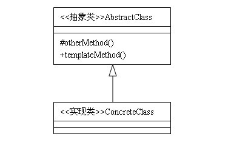

定义：定义一个操作中算法的框架，而将一些步骤延迟到子类中，使得子类可以不改变算法的结构即可重定义该算法中的某些特定步骤。  

类型：行为类模式  

类图：



事实上，模版方法是编程中一个经常用到的模式。先来看一个例子，某日，程序员A拿到一个任务：给定一个整数数组，把数组中的数由小到大排序，然后把排序之后的结果打印出来。经过分析之后，这个任务大体上可分为两部分，排序和打印，打印功能好实现，排序就有点麻烦了。但是A有办法，先把打印功能完成，排序功能另找人做。

```java
abstract class AbstractSort {  

    /**
     * 将数组array由小到大排序
     * @param array
     */  
    protected abstract void sort(int[] array);  

    public void showSortResult(int[] array){  
        this.sort(array);  
        System.out.print("排序结果：");  
        for (int i = 0; i < array.length; i++){  
            System.out.printf("%3s", array[i]);  
        }  
    }  
}
```
写完后，A找到刚毕业入职不久的同事B说：有个任务，主要逻辑我已经写好了，你把剩下的逻辑实现一下吧。于是把AbstractSort类给B，让B写实现。B拿过来一看，太简单了，10分钟搞定，代码如下：

```java
class ConcreteSort extends AbstractSort {  

    @Override  
    protected void sort(int[] array){  
        for(int i=0; i<array.length-1; i++){  
            selectSort(array, i);  
        }  
    }  

    private void selectSort(int[] array, int index) {  
        int MinValue = 32767; // 最小值变量  
        int indexMin = 0; // 最小值索引变量  
        int Temp; // 暂存变量  
        for (int i = index; i < array.length; i++) {  
            if (array[i] < MinValue){ // 找到最小值  
                MinValue = array[i]; // 储存最小值  
                indexMin = i;   
            }  
        }  
        Temp = array[index]; // 交换两数值  
        array[index] = array[indexMin];  
        array[indexMin] = Temp;  
    }  
}  
```

写好后交给A，A拿来一运行：

```java
public class Client {  
    public static int[] a = { 10, 32, 1, 9, 5, 7, 12, 0, 4, 3 }; // 预设数据数组  
    public static void main(String[] args){  
        AbstractSort s = new ConcreteSort();  
        s.showSortResult(a);  
    }  
}  
```
运行结果：

```
排序结果：  0  1  3  4  5  7  9 10 12 32
```
运行正常。行了，任务完成。没错，这就是模版方法模式。大部分刚步入职场的毕业生应该都有类似B的经历。一个复杂的任务，由公司中的牛人们将主要的逻辑写好，然后把那些看上去比较简单的方法写成抽象的，交给其他的同事去开发。这种分工方式在编程人员水平层次比较明显的公司中经常用到。比如一个项目组，有架构师，高级工程师，初级工程师，则一般由架构师使用大量的接口、抽象类将整个系统的逻辑串起来，实现的编码则根据难度的不同分别交给高级工程师和初级工程师来完成。怎么样，是不是用到过模版方法模式？

## 模版方法模式的结构

模版方法模式由一个抽象类和一个（或一组）实现类通过继承结构组成，抽象类中的方法分为三种：

- 抽象方法：父类中只声明但不加以实现，而是定义好规范，然后由它的子类去实现。
- 模版方法：由抽象类声明并加以实现。一般来说，模版方法调用抽象方法来完成主要的逻辑功能，并且，模版方法大多会定义为final类型，指明主要的逻辑功能在子类中不能被重写。
- 钩子方法：由抽象类声明并加以实现。但是子类可以去扩展，子类可以通过扩展钩子方法来影响模版方法的逻辑。

抽象类的任务是搭建逻辑的框架，通常由经验丰富的人员编写，因为抽象类的好坏直接决定了程序是否稳定性。

实现类用来实现细节。抽象类中的模版方法正是通过实现类扩展的方法来完成业务逻辑。只要实现类中的扩展方法通过了单元测试，在模版方法正确的前提下，整体功能一般不会出现大的错误。

## 模版方法的优点及适用场景

容易扩展。一般来说，抽象类中的模版方法是不易反生改变的部分，而抽象方法是容易反生变化的部分，因此通过增加实现类一般可以很容易实现功能的扩展，符合开闭原则。

便于维护。对于模版方法模式来说，正是由于他们的主要逻辑相同，才使用了模版方法，假如不使用模版方法，任由这些相同的代码散乱的分布在不同的类中，维护起来是非常不方便的。

比较灵活。因为有钩子方法，因此，子类的实现也可以影响父类中主逻辑的运行。但是，在灵活的同时，由于子类影响到了父类，违反了里氏替换原则，也会给程序带来风险。这就对抽象类的设计有了更高的要求。

在多个子类拥有相同的方法，并且这些方法逻辑相同时，可以考虑使用模版方法模式。在程序的主框架相同，细节不同的场合下，也比较适合使用这种模式。
