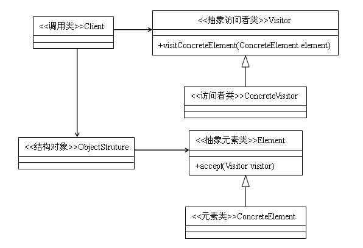

定义：封装某些作用于某种数据结构中各元素的操作，它可以在不改变数据结构的前提下定义作用于这些元素的新的操作。

类型：行为类模式

类图：



访问者模式可能是行为类模式中最复杂的一种模式了，但是这不能成为我们不去掌握它的理由。我们首先来看一个简单的例子，代码如下：
```java
class A {  
    public void method1(){  
        System.out.println("我是A");  
    }  

    public void method2(B b){  
        b.showA(this);  
    }  
}  

class B {  
    public void showA(A a){  
        a.method1();  
    }  
}  
```

我们主要来看一下在类A中，方法method1和方法method2的区别在哪里，方法method1很简单，就是打印出一句“我是A”；方法method2稍微复杂一点，使用类B作为参数，并调用类B的showA方法。再来看一下类B的showA方法，showA方法使用类A作为参数，然后调用类A的method1方法，可以看到，method2方法绕来绕去，无非就是调用了一下自己的method1方法而已，它的运行结果应该也是“我是A”，分析完之后，我们来运行一下这两个方法，并看一下运行结果：

```java
public class Test {  
    public static void main(String[] args){  
        A a = new A();  
        a.method1();  
        a.method2(new B());  
    }  
}  
```

运行结果为：
```
我是A
我是A
```

看懂了这个例子，就理解了访问者模式的90%，在例子中，对于类A来说，类B就是一个访问者。但是这个例子并不是访问者模式的全部，虽然直观，但是它的可扩展性比较差，下面我们就来说一下访问者模式的通用实现，通过类图可以看到，在访问者模式中，主要包括下面几个角色：

抽象访问者：抽象类或者接口，声明访问者可以访问哪些元素，具体到程序中就是visit方法中的参数定义哪些对象是可以被访问的。

访问者：实现抽象访问者所声明的方法，它影响到访问者访问到一个类后该干什么，要做什么事情。

抽象元素类：接口或者抽象类，声明接受哪一类访问者访问，程序上是通过accept方法中的参数来定义的。抽象元素一般有两类方法，一部分是本身的业务逻辑，另外就是允许接收哪类访问者来访问。

元素类：实现抽象元素类所声明的accept方法，通常都是visitor.visit(this)，基本上已经形成一种定式了。

结构对象：一个元素的容器，一般包含一个容纳多个不同类、不同接口的容器，如List、Set、Map等，在项目中一般很少抽象出这个角色。

访问者模式的通用代码实现

```java
abstract class Element {  
    public abstract void accept(IVisitor visitor);  
    public abstract void doSomething();  
}  

interface IVisitor {  
    public void visit(ConcreteElement1 el1);  
    public void visit(ConcreteElement2 el2);  
}  

class ConcreteElement1 extends Element {  
    public void doSomething(){  
        System.out.println("这是元素1");  
    }  

    public void accept(IVisitor visitor) {  
        visitor.visit(this);  
    }  
}  

class ConcreteElement2 extends Element {  
    public void doSomething(){  
        System.out.println("这是元素2");  
    }  

    public void accept(IVisitor visitor) {  
        visitor.visit(this);  
    }  
}  
class Visitor implements IVisitor {  

    public void visit(ConcreteElement1 el1) {  
        el1.doSomething();  
    }  

    public void visit(ConcreteElement2 el2) {  
        el2.doSomething();  
    }  
}  

class ObjectStruture {  
    public static List<Element> getList(){  
        List<Element> list = new ArrayList<Element>();  
        Random ran = new Random();  
        for(int i=0; i<10; i++){  
            int a = ran.nextInt(100);  
            if(a>50){  
                list.add(new ConcreteElement1());  
            }else{  
                list.add(new ConcreteElement2());  
            }  
        }  
        return list;  
    }  
}  

public class Client {  
    public static void main(String[] args){  
        List<Element> list = ObjectStruture.getList();  
        for(Element e: list){  
            e.accept(new Visitor());  
        }  
    }  
}  
```

## 访问者模式的优点

符合单一职责原则：凡是适用访问者模式的场景中，元素类中需要封装在访问者中的操作必定是与元素类本身关系不大且是易变的操作，使用访问者模式一方面符合单一职责原则，另一方面，因为被封装的操作通常来说都是易变的，所以当发生变化时，就可以在不改变元素类本身的前提下，实现对变化部分的扩展。

扩展性良好：元素类可以通过接受不同的访问者来实现对不同操作的扩展。

## 访问者模式的适用场景

假如一个对象中存在着一些与本对象不相干（或者关系较弱）的操作，为了避免这些操作污染这个对象，则可以使用访问者模式来把这些操作封装到访问者中去。

假如一组对象中，存在着相似的操作，为了避免出现大量重复的代码，也可以将这些重复的操作封装到访问者中去。

但是，访问者模式并不是那么完美，它也有着致命的缺陷：增加新的元素类比较困难。通过访问者模式的代码可以看到，在访问者类中，每一个元素类都有它对应的处理方法，也就是说，每增加一个元素类都需要修改访问者类（也包括访问者类的子类或者实现类），修改起来相当麻烦。也就是说，在元素类数目不确定的情况下，应该慎用访问者模式。所以，访问者模式比较适用于对已有功能的重构，比如说，一个项目的基本功能已经确定下来，元素类的数据已经基本确定下来不会变了，会变的只是这些元素内的相关操作，这时候，我们可以使用访问者模式对原有的代码进行重构一遍，这样一来，就可以在不修改各个元素类的情况下，对原有功能进行修改。

## 总结

正如《设计模式》的作者GoF对访问者模式的描述：大多数情况下，你并需要使用访问者模式，但是当你一旦需要使用它时，那你就是真的需要它了。当然这只是针对真正的大牛而言。在现实情况下（至少是我所处的环境当中），很多人往往沉迷于设计模式，他们使用一种设计模式时，从来不去认真考虑所使用的模式是否适合这种场景，而往往只是想展示一下自己对面向对象设计的驾驭能力。编程时有这种心理，往往会发生滥用设计模式的情况。所以，在学习设计模式时，一定要理解模式的适用性。必须做到使用一种模式是因为了解它的优点，不使用一种模式是因为了解它的弊端；而不是使用一种模式是因为不了解它的弊端，不使用一种模式是因为不了解它的优点。
