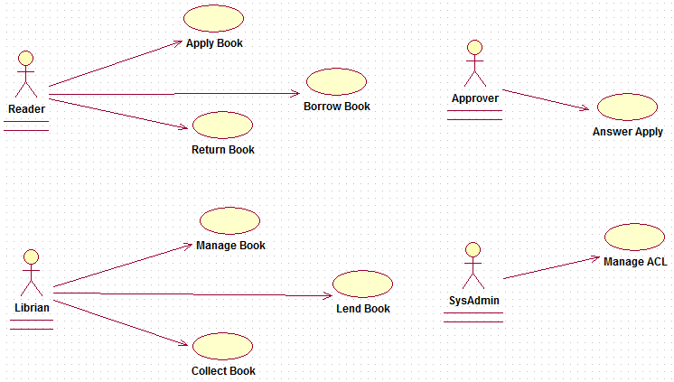
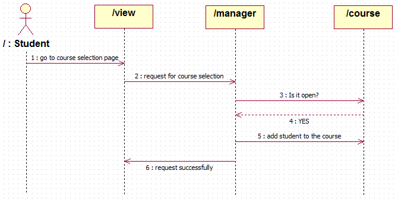
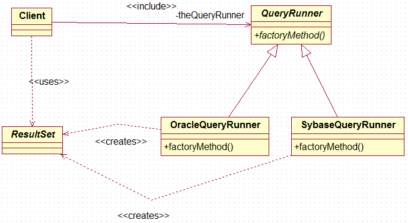
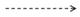
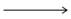
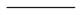
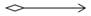
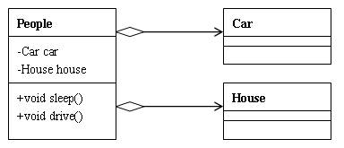
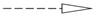
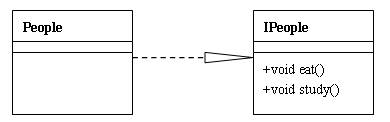

## UML建模语言

UML 是统一建模语言（Unified Modeling Language）的缩写，它发表于 1997 年，综合了当时已经存在的面向对象的建模语言、方法和过程，是一个支持模型化和软件系统开发的图形化语言，为软件开发的所有阶段提供模型化和可视化支持。使用 UML 可以帮助沟通与交流，辅助应用设计和文档的生成，还能够阐释系统的结构和行为。UML 定义了多种图形化的符号来描述软件系统部分或全部的静态结构和动态结构，包括：用例图（use case diagram）、类图（class diagram）、时序图（sequence diagram）、协作图（collaboration diagram）、状态图（statechart diagram）、活动图（activity diagram）、构件图（component diagram）、部署图（deployment diagram）等。在这些图形化符号中，有三种图最为重要，分别是：用例图（用来捕获需求，描述系统的功能，通过该图可以迅速的了解系统的功能模块及其关系）、类图（描述类以及类与类之间的关系，通过该图可以快速了解系统）、时序图（描述执行特定任务时对象之间的交互关系以及执行顺序，通过该图可以了解对象能接收的消息也就是说对象能够向外界提供的服务）

## 用例图



## 时序图



## 类图


- +表示public
- -表示private
- \#表示protected
- 什么都没有代表包可见
- 以<<开头和以>>结尾的为注释信息
- 带下划线的属性或方法代表是静态的



在[Java](http://lib.csdn.net/base/javase)以及其他的面向对象设计模式中，类与类之间主要有6种关系，他们分别是：依赖、关联、聚合、组合、继承、实现。他们的耦合度依次增强。

## 1. 依赖（Dependence） 


依赖关系的定义为：对于两个相对独立的对象，当一个对象负责构造另一个对象的实例，或者依赖另一个对象的服务时，这两个对象之间主要体现为依赖关系。定义比较晦涩难懂，但在java中的表现还是比较直观的：类A当中使用了类B，其中类B是作为类A的方法参数、方法中的局部变量、或者静态方法调用。类上面的图例中：People类依赖于Book类和Food类，Book类和Food类是作为类中方法的参数形式出现在People类中的。

**代码样例：**

```java
public class People{  
    //Book作为read方法的形参  
     public void read(Book book){  
        System.out.println(“读的书是”+book.getName());  
    }  
}  
```

## 2. 关联（Association）、、

**单向关联：**


**双向关联：**


对于两个相对独立的对象，当一个对象的实例与另一个对象的一些特定实例存在固定的对应关系时，这两个对象之间为关联关系。关联关系分为单向关联和双向关联。在java中，单向关联表现为：类A当中使用了类B，其中类B是作为类A的成员变量。双向关联表现为：类A当中使用了类B作为成员变量；同时类B中也使用了类A作为成员变量。

**代码样例：**

```java
public class Son{  
   //关联关系中作为成员变量的类一般会在类中赋值  
    Father father = new Father();  
    public void getGift(){  
        System.out.println(“从”+father.getName()+”获得礼物”);  
    }  
}  
  
public class Father{  
     Son son = new Son();  
     public void giveGift(){  
         System.out.println(“送给”+son.getName()+“礼物”);  
     }  
 }  
```

## 3. 聚合（Aggregation）



聚合关系是关联关系的一种，耦合度强于关联，他们的代码表现是相同的，仅仅是在语义上有所区别：关联关系的对象间是相互独立的，而聚合关系的对象之间存在着包容关系，他们之间是“整体-个体”的相互关系。

**代码样例：**

```java
public class People{  
    Car car;  
    House house;   
    //聚合关系中作为成员变量的类一般使用set方法赋值  
     public void setCar(Car car){  
        This.car = car;  
    }  
    public void setHouse(House house){  
        This.house = house;  
     }  
   
     public void driver(){  
         System.out.println(“车的型号：”+car.getType());  
     }  
     public void sleep(){  
         System.out.println(“我在房子里睡觉：”+house.getAddress());  
     }  
 }  
```

## 4. 组合（Composition）


相比于聚合，组合是一种耦合度更强的关联关系。存在组合关系的类表示“整体-部分”的关联关系，“整体”负责“部分”的生命周期，他们之间是共生共死的；并且“部分”单独存在时没有任何意义。在下图的例子中，People与Soul、Body之间是组合关系，当人的生命周期开始时，必须同时有灵魂和肉体；当人的生命周期结束时，灵魂肉体随之消亡；无论是灵魂还是肉体，都不能单独存在，他们必须作为人的组成部分存在。

```java
Public class People{  
    Soul soul;  
    Body body;   
    //组合关系中的成员变量一般会在构造方法中赋值  
     Public People(Soul soul, Body body){   
        This.soul = soul;  
        This.body = body;  
    }  
  
     Public void study(){  
         System.out.println(“学习要用灵魂”+soul.getName());  
     }  
     Public void eat(){  
         System.out.println(“吃饭用身体：”+body.getName());  
     }  
 }  
```

## 5. 继承（Generalization）


继承表示类与类（或者接口与接口）之间的父子关系。在java中，用关键字extends表示继承关系。UML图例中，继承关系用实线+空心箭头表示，箭头指向父类。

## 6. 实现（Implementation）



表示一个类实现一个或多个接口的方法。接口定义好操作的集合，由实现类去完成接口的具体操作。在java中使用implements表示。UML图例中，实现关系用虚线+空心箭头表示，箭头指向接口。

在java中继承使用extends关键字，实现使用implements关键字，很直观。就不代码演示了。
