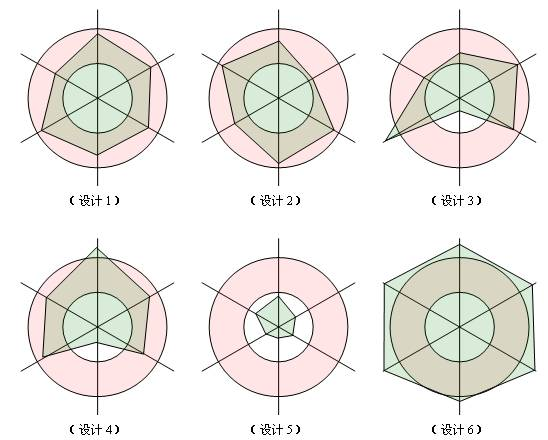

定义：一个软件实体如类、模块和函数应该对扩展开放，对修改关闭。

问题由来：在软件的生命周期内，因为变化、升级和维护等原因需要对软件原有代码进行修改时，可能会给旧代码中引入错误，也可能会使我们不得不对整个功能进行重构，并且需要原有代码经过重新测试。

解决方案：当软件需要变化时，尽量通过扩展软件实体的行为来实现变化，而不是通过修改已有的代码来实现变化。

开闭原则是面向对象设计中最基础的设计原则，它指导我们如何建立稳定灵活的系统。开闭原则可能是设计模式六项原则中定义最模糊的一个了，它只告诉我们对扩展开放，对修改关闭，可是到底如何才能做到对扩展开放，对修改关闭，并没有明确的告诉我们。以前，如果有人告诉我“你进行设计的时候一定要遵守开闭原则”，我会觉的他什么都没说，但貌似又什么都说了。因为开闭原则真的太虚了。

在仔细思考以及仔细阅读很多设计模式的文章后，终于对开闭原则有了一点认识。其实，我们遵循设计模式前面5大原则，以及使用23种设计模式的目的就是遵循开闭原则。也就是说，只要我们对前面5项原则遵守的好了，设计出的软件自然是符合开闭原则的，这个开闭原则更像是前面五项原则遵守程度的“平均得分”，前面5项原则遵守的好，平均分自然就高，说明软件设计开闭原则遵守的好；如果前面5项原则遵守的不好，则说明开闭原则遵守的不好。

其实笔者认为，开闭原则无非就是想表达这样一层意思：用抽象构建框架，用实现扩展细节。因为抽象灵活性好，适应性广，只要抽象的合理，可以基本保持软件架构的稳定。而软件中易变的细节，我们用从抽象派生的实现类来进行扩展，当软件需要发生变化时，我们只需要根据需求重新派生一个实现类来扩展就可以了。当然前提是我们的抽象要合理，要对需求的变更有前瞻性和预见性才行。

说到这里，再回想一下前面说的5项原则，恰恰是告诉我们用抽象构建框架，用实现扩展细节的注意事项而已：单一职责原则告诉我们实现类要职责单一；里氏替换原则告诉我们不要破坏继承体系；依赖倒置原则告诉我们要面向接口编程；接口隔离原则告诉我们在设计接口的时候要精简单一；迪米特法则告诉我们要降低耦合。而开闭原则是总纲，他告诉我们要对扩展开放，对修改关闭。

最后说明一下如何去遵守这六个原则。对这六个原则的遵守并不是是和否的问题，而是多和少的问题，也就是说，我们一般不会说有没有遵守，而是说遵守程度的多少。任何事都是过犹不及，设计模式的六个设计原则也是一样，制定这六个原则的目的并不是要我们刻板的遵守他们，而需要根据实际情况灵活运用。对他们的遵守程度只要在一个合理的范围内，就算是良好的设计。我们用一幅图来说明一下。

图中的每一条维度各代表一项原则，我们依据对这项原则的遵守程度在维度上画一个点，则如果对这项原则遵守的合理的话，这个点应该落在红色的同心圆内部；如果遵守的差，点将会在小圆内部；如果过度遵守，点将会落在大圆外部。一个良好的设计体现在图中，应该是六个顶点都在同心圆中的六边形。

在上图中，设计1、设计2属于良好的设计，他们对六项原则的遵守程度都在合理的范围内；设计3、设计4设计虽然有些不足，但也基本可以接受；设计5则严重不足，对各项原则都没有很好的遵守；而设计6则遵守过渡了，设计5和设计6都是迫切需要重构的设计。

到这里，设计模式的六大原则就写完了。主要参考书籍有《设计模式》《设计模式之禅》《大话设计模式》以及网上一些零散的文章，但主要内容主要还是我本人对这六个原则的感悟。写出来的目的一方面是对这六项原则系统地整理一下，一方面也与广大的网友分享，因为设计模式对编程人员来说，的确非常重要。正如有句话叫做一千个读者眼中有一千个哈姆雷特，如果大家对这六项原则的理解跟我有所不同，欢迎留言，大家共同探讨。

下面是前面5项设计原则的链接

- 单一职责原则（Single Responsibility Principle）
- 里氏替换原则（Liskov Substitution Principle）
- 依赖倒置原则（Dependence Inversion Principle）
- 接口隔离原则（Interface Segregation Principle）
- 迪米特法则（Law Of Demeter）

同时为了方便想收藏的朋友，下面给出word版本的下载。[word版本下载链接：设计模式六大原则](http://download.csdn.net/detail/zhengzhb/4092743)