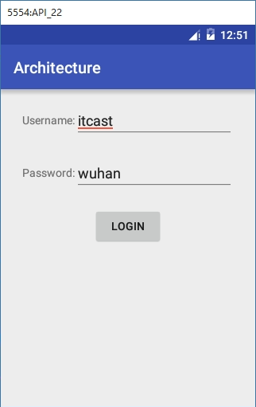

## Demo

用MVC、MVP和MVVM分别实现登录界面的功能



### MVC

布局文件

```xml
<?xml version="1.0" encoding="utf-8"?>
<LinearLayout xmlns:android="http://schemas.android.com/apk/res/android"
    xmlns:tools="http://schemas.android.com/tools"
    android:layout_width="match_parent"
    android:layout_height="match_parent"
    android:orientation="vertical"
    android:paddingBottom="@dimen/activity_vertical_margin"
    android:paddingLeft="@dimen/activity_horizontal_margin"
    android:paddingRight="@dimen/activity_horizontal_margin"
    android:paddingTop="@dimen/activity_vertical_margin"
    >

    <LinearLayout
        android:layout_width="match_parent"
        android:layout_height="wrap_content"
        android:gravity="center"
        android:orientation="horizontal">

        <TextView
            android:layout_width="wrap_content"
            android:layout_height="wrap_content"
            android:text="Username:" />

        <EditText
            android:id="@+id/username"
            android:layout_width="200dp"
            android:layout_height="wrap_content" />
    </LinearLayout>

    <LinearLayout
        android:layout_width="match_parent"
        android:layout_height="wrap_content"
        android:layout_marginTop="20dp"
        android:gravity="center"
        android:orientation="horizontal">

        <TextView
            android:layout_width="wrap_content"
            android:layout_height="wrap_content"
            android:text="Password:" />

        <EditText
            android:id="@+id/password"
            android:layout_width="200dp"
            android:layout_height="wrap_content" />
    </LinearLayout>

    <Button
        android:id="@+id/login"
        android:layout_width="wrap_content"
        android:layout_height="wrap_content"
        android:layout_gravity="center"
        android:layout_marginTop="20dp"
        android:onClick="login"
        android:text="login" />
</LinearLayout>
```
MainActivity.java
```java
package cn.itcast.architecture;

import android.app.Activity;
import android.app.ProgressDialog;
import android.os.SystemClock;
import android.support.v7.app.AppCompatActivity;
import android.os.Bundle;
import android.text.TextUtils;
import android.view.View;
import android.widget.EditText;
import android.widget.Toast;

import cn.itcast.architecture.bean.User;
import cn.itcast.architecture.net.UserLoginNet;

public class MainActivity extends AppCompatActivity {
    /*

    流程：
    1、界面展示
    2、用户的输入
    3、按钮点击
    4、判断用户输入
    5、显示滚动条
    6、一系列耗时工作
    7、隐藏
    8、提示用户

    MainActivity中处理所有代码
    按照MVC模式拆分

    存在问题：
    Activity中存在两部分内容：业务相关+界面相关
    V中的内容相对较少而C中的内容很多
    解决方案：
    1、如果将Activity中的业务部分拆分——MVP
    2、如果将Activity中的界面相关内容拆分——MVVM
     */

    private EditText mUsername;
    private EditText mPassword;
    private ProgressDialog dialog;

    @Override
    protected void onCreate(Bundle savedInstanceState) {
        super.onCreate(savedInstanceState);
        setContentView(R.layout.activity_main);
        mUsername = (EditText) findViewById(R.id.username);
        mPassword = (EditText) findViewById(R.id.password);
        dialog = new ProgressDialog(this);
    }

    /**
     * 按钮点击
     * @param view
     */
    public void login(View view) {
        final String username = mUsername.getText().toString();
        final String password = mPassword.getText().toString();
        final User user=new User();
        user.username=username;
        user.password=password;
        boolean userInfo = checkUserInfo(user);
        if(userInfo){
            dialog.show();
            new Thread(){
                @Override
                public void run() {
                    UserLoginNet net=new UserLoginNet();

                    if(net.sendUserLoginInfo(user)){
                        runOnUiThread(new Runnable() {
                            @Override
                            public void run() {
                                // 登陆成功
                                dialog.dismiss();
                                Toast.makeText(MainActivity.this, "欢迎回来"+username, Toast.LENGTH_SHORT).show();
                            }
                        });

                    }else{
                        //登陆失败
                        runOnUiThread(new Runnable() {
                            @Override
                            public void run() {
                                // 登陆成功
                                dialog.dismiss();
                                Toast.makeText(MainActivity.this, "用户名或密码输入有误", Toast.LENGTH_SHORT).show();
                            }
                        });
                    }

                }
            }.start();
        }else{
            Toast.makeText(MainActivity.this, "用户名或密码不能为空", Toast.LENGTH_SHORT).show();
        }
    }

    /**
     * 判断用户输入
     * @param user
     * @return
     */
    private boolean checkUserInfo(User user) {
        if(TextUtils.isEmpty(user.username)||TextUtils.isEmpty(user.password)){
            return false;
        }
        return true;
    }
}
```
UserLoginNet.java，模拟网络请求
```java
package cn.itcast.architecture.net;

import android.os.SystemClock;
import android.widget.Toast;

import cn.itcast.architecture.bean.User;

public class UserLoginNet {

    /**
     * 发送用户输入数据
     * @param user
     * @return
     */
    public boolean sendUserLoginInfo(User user){
        SystemClock.sleep(2000);
        if("itcast".equals(user.username)&&"wuhan".equals(user.password)){
           return true;
        }else{
            //登陆失败
           return false;
        }
    }
}
```

```java
package cn.itcast.architecture.bean;

public class User {
    public String username;
    public String password;
}
```

### MVP

MainActivity.java

```java
package cn.itcast.mvp;

import android.app.ProgressDialog;
import android.support.v7.app.AppCompatActivity;
import android.os.Bundle;
import android.view.View;
import android.widget.EditText;
import android.widget.Toast;

import cn.itcast.mvp.bean.User;
import cn.itcast.mvp.presenter.UserLoginPresenter;

public class MainActivity extends AppCompatActivity implements IUserLoginView{

    private EditText mUsername;
    private EditText mPassword;
    private ProgressDialog dialog;

    private UserLoginPresenter presenter;

    @Override
    protected void onCreate(Bundle savedInstanceState) {
        super.onCreate(savedInstanceState);
        setContentView(R.layout.activity_main);

        mUsername = (EditText) findViewById(R.id.username);
        mPassword = (EditText) findViewById(R.id.password);
        dialog = new ProgressDialog(this);

        presenter = new UserLoginPresenter(this);
    }

    /**
     * 按钮点击
     * @param view
     */
    public void login(View view) {
        final String username = mUsername.getText().toString();
        final String password = mPassword.getText().toString();
        final User user=new User();
        user.username=username;
        user.password=password;

        boolean userInfo = presenter.checkUserInfo(user);

        if(userInfo){
            dialog.show();
            presenter.login(user);
        }else{
            Toast.makeText(MainActivity.this, "用户名或密码不能为空", Toast.LENGTH_SHORT).show();
        }
    }

    /**
     * 登陆成功
     */
    public void success(){
        runOnUiThread(new Runnable() {
            @Override
            public void run() {
                // 登陆成功
                dialog.dismiss();
                Toast.makeText(MainActivity.this, "欢迎回来"+mUsername.getText().toString(), Toast.LENGTH_SHORT).show();
            }
        });
    }

    /**
     * 登陆失败
     */
    public void failed(){
        runOnUiThread(new Runnable() {
            @Override
            public void run() {
                // 登陆失败
                dialog.dismiss();
                Toast.makeText(MainActivity.this, "用户名或密码输入有误", Toast.LENGTH_SHORT).show();
            }
        });
    }
}
```
IUserLoginView.java
```java
package cn.itcast.mvp;

public interface IUserLoginView {
    /**
     * 登陆成功
     */
    void success();

    /**
     * 登陆失败
     */
    void failed();
}
```
UserLoginPresenter.java
```java
package cn.itcast.mvp.presenter;

import android.text.TextUtils;
import android.widget.Toast;

import cn.itcast.mvp.IUserLoginView;
import cn.itcast.mvp.MainActivity;
import cn.itcast.mvp.bean.User;
import cn.itcast.mvp.net.UserLoginNet;

public class UserLoginPresenter {
    // Activity 和 Fragment 通用性不好
    // 提高通用性：放置参数为通用（抽象类或接口，实际开发中接口更通用）
    private IUserLoginView view;
    public UserLoginPresenter(IUserLoginView view){
        this.view=view;
    }

    /**
     * 判断用户输入
     *
     * @param user
     * @return
     */
    public boolean checkUserInfo(User user) {
        if(TextUtils.isEmpty(user.username)||TextUtils.isEmpty(user.password)){
            return false;
        }
        return true;
    }

    /**
     * 用户登录
     * @param user
     */
    public void login(final User user){
        new Thread(){
            @Override
            public void run() {
                UserLoginNet net=new UserLoginNet();
                if(net.sendUserLoginInfo(user)){
                    // 登陆成功
                    view.success();
                }else{
                    //登陆失败
                    view.failed();
                }
            }
        }.start();
    }
}
```
UserLoginNet.java
```java
package cn.itcast.mvp.net;

import android.os.SystemClock;
import cn.itcast.mvp.bean.User;

public class UserLoginNet {

    /**
     * 发送用户输入数据
     * @param user
     * @return
     */
    public boolean sendUserLoginInfo(User user){
        SystemClock.sleep(2000);
        if("itcast".equals(user.username)&&"wuhan".equals(user.password)){
           return true;
        }else{
            //登陆失败
           return false;
        }
    }
}
```
User.java
```java
package cn.itcast.mvp.bean;

public class User {
    public String username;
    public String password;
}
```
### MVVM

MVVM模式使用到Data Binding，需要在build.gradle文件中配置

```gradle
apply plugin: 'com.android.application'

android {
    compileSdkVersion 25
    buildToolsVersion "25.0.2"

    defaultConfig {
        applicationId "cn.itcast.mvvm"
        minSdkVersion 14
        targetSdkVersion 25
        versionCode 1
        versionName "1.0"
    }
    buildTypes {
        release {
            minifyEnabled false
            proguardFiles getDefaultProguardFile('proguard-android.txt'), 'proguard-rules.pro'
        }
    }
    dataBinding{
        enabled=true // 设置dataBinding为可用
    }
}

dependencies {
    compile fileTree(dir: 'libs', include: ['*.jar'])
    testCompile 'junit:junit:4.12'
    compile 'com.android.support:appcompat-v7:25.3.0'
}
```

布局文件

```xml
<?xml version="1.0" encoding="utf-8"?>
<layout  xmlns:android="http://schemas.android.com/apk/res/android">
    <data>
        <variable
            name="event"
            type="cn.itcast.mvvm.UserEvent" />
    </data>
<LinearLayout
    xmlns:tools="http://schemas.android.com/tools"
    android:layout_width="match_parent"
    android:layout_height="match_parent"
    android:orientation="vertical"
    android:paddingBottom="@dimen/activity_vertical_margin"
    android:paddingLeft="@dimen/activity_horizontal_margin"
    android:paddingRight="@dimen/activity_horizontal_margin"
    android:paddingTop="@dimen/activity_vertical_margin"
    >

    <LinearLayout
        android:layout_width="match_parent"
        android:layout_height="wrap_content"
        android:gravity="center"
        android:orientation="horizontal">

        <TextView
            android:layout_width="wrap_content"
            android:layout_height="wrap_content"
            android:text="Username:" />

        <EditText
            android:id="@+id/username"
            android:layout_width="200dp"
            android:layout_height="wrap_content"
            android:addTextChangedListener="@{event.usernameWatcher}"/>
    </LinearLayout>

    <LinearLayout
        android:layout_width="match_parent"
        android:layout_height="wrap_content"
        android:layout_marginTop="20dp"
        android:gravity="center"
        android:orientation="horizontal">

        <TextView
            android:layout_width="wrap_content"
            android:layout_height="wrap_content"
            android:text="Password:" />

        <EditText
            android:id="@+id/password"
            android:layout_width="200dp"
            android:layout_height="wrap_content"
            addTextChangedListener="@{event.passwordWatcher}"/>
    </LinearLayout>

    <Button
        android:id="@+id/login"
        android:layout_width="wrap_content"
        android:layout_height="wrap_content"
        android:layout_gravity="center"
        android:layout_marginTop="20dp"
        android:onClick="login"
        android:text="login" />
</LinearLayout>
</layout>
```
MainActivity.java
```java
package cn.itcast.mvvm;

import android.app.ProgressDialog;
import android.databinding.DataBindingUtil;
import android.os.Bundle;
import android.support.v7.app.AppCompatActivity;
import android.text.TextUtils;
import android.view.View;
import android.widget.EditText;
import android.widget.Toast;

import cn.itcast.mvvm.bean.User;
import cn.itcast.mvvm.databinding.ActivityMainBinding;
import cn.itcast.mvvm.net.UserLoginNet;


public class MainActivity extends AppCompatActivity {
    /*

    流程：
    1、界面展示
    2、用户的输入
    3、按钮点击
    4、判断用户输入
    5、显示滚动条
    6、一系列耗时工作
    7、隐藏
    8、提示用户

    MainActivity中处理所有代码
    按照MVC模式拆分

    存在问题：
    Activity中存在两部分内容：业务相关+界面相关
    V中的内容相对较少而C中的内容很多
    解决方案：
    1、如果将Activity中的业务部分拆分——MVP
    2、如果将Activity中的界面相关内容拆分——MVVM
     */

    private ProgressDialog dialog;
    private User user;

    @Override
    protected void onCreate(Bundle savedInstanceState) {
        super.onCreate(savedInstanceState);

        ActivityMainBinding binding = DataBindingUtil.setContentView(this, R.layout.activity_main);
        user = new User();
        UserEvent event=new UserEvent(user);
        binding.setEvent(event);

        dialog = new ProgressDialog(this);
    }

    /**
     * 按钮点击
     *
     * @param view
     */
    public void login(View view) {


        boolean userInfo = checkUserInfo(user);
        if(userInfo){
            dialog.show();
            new Thread(){
                @Override
                public void run() {
                    UserLoginNet net=new UserLoginNet();

                    if(net.sendUserLoginInfo(user)){
                        runOnUiThread(new Runnable() {
                            @Override
                            public void run() {
                                // 登陆成功
                                dialog.dismiss();
                                Toast.makeText(MainActivity.this, "欢迎回来"+user.username, Toast.LENGTH_SHORT).show();
                            }
                        });

                    }else{
                        //登陆失败
                        runOnUiThread(new Runnable() {
                            @Override
                            public void run() {
                                // 登陆成功
                                dialog.dismiss();
                                Toast.makeText(MainActivity.this, "用户名或密码输入有误", Toast.LENGTH_SHORT).show();
                            }
                        });
                    }

                }
            }.start();
        }else{
            Toast.makeText(MainActivity.this, "用户名或密码不能为空", Toast.LENGTH_SHORT).show();
        }
    }

    /**
     * 判断用户输入
     *
     * @param user
     * @return
     */
    private boolean checkUserInfo(User user) {
        if(TextUtils.isEmpty(user.username)||TextUtils.isEmpty(user.password)){
            return false;
        }
        return true;
    }
}
```
UserEvent.java
```java
package cn.itcast.mvvm;

import android.text.Editable;
import android.text.TextWatcher;

import cn.itcast.mvvm.bean.User;

public class UserEvent {

    private User user;
    public UserEvent(User user){
        this.user=user;
    }

    public TextWatcher usernameWatcher=new TextWatcher() {
        @Override
        public void beforeTextChanged(CharSequence s, int start, int count, int after) {

        }

        @Override
        public void onTextChanged(CharSequence s, int start, int before, int count) {

        }

        @Override
        public void afterTextChanged(Editable s) {
            user.username=s.toString();
        }
    };

    public TextWatcher passwordWatcher=new TextWatcher() {
        @Override
        public void beforeTextChanged(CharSequence s, int start, int count, int after) {

        }

        @Override
        public void onTextChanged(CharSequence s, int start, int before, int count) {

        }

        @Override
        public void afterTextChanged(Editable s) {
            user.password=s.toString();
        }
    };
}
```
UserLoginNet.java
```java
package cn.itcast.mvvm.net;

import android.os.SystemClock;

import cn.itcast.mvvm.bean.User;

public class UserLoginNet {

    /**
     * 发送用户输入数据
     * @param user
     * @return
     */
    public boolean sendUserLoginInfo(User user){


        SystemClock.sleep(2000);

        if("itcast".equals(user.username)&&"wuhan".equals(user.password)){
           return true;

        }else{
            //登陆失败
           return false;
        }
    }
}
```
User.java
```java
package cn.itcast.mvvm.bean;

public class User {
    public String username;
    public String password;
}
```
### MVP+Dagger2

MainActivity，指定需要注入的目标

```java
public class MainActivity extends AppCompatActivity {

    @BindView(R.id.username)
    EditText mUsername;
    @BindView(R.id.password)
    EditText mPassword;

    private ProgressDialog dialog;

    // 第一步：指定需要注入的目标
    @Inject
    MainActivityPresenter presenter;


    @Override
    protected void onCreate(Bundle savedInstanceState) {
        super.onCreate(savedInstanceState);
        setContentView(R.layout.activity_main);
        ButterKnife.bind(this);


        dialog = new ProgressDialog(this);

        // 此处会实例化具体P层的对象，一旦new出来了，两层之间也就耦合到一起了。
        // presenter = new MainActivityPresenter(this);

        DaggerMainActivityComponent component = (DaggerMainActivityComponent) 
                DaggerMainActivityComponent
                .builder()
                .mainActivityModule(new MainActivityModule(this))
                .build();
        component.inject(this);
    }

    /**
     * 按钮点击
     *
     * @param view
     */
    public void login(View view) {
        String username = mUsername.getText().toString();
        String password = mPassword.getText().toString();

        boolean checkUserInfo = checkUserInfo(username, password);

        if (checkUserInfo) {
            dialog.show();
            presenter.login(username, password);
        } else {
            Toast.makeText(MainActivity.this, "用户名或密码不能为空", Toast.LENGTH_SHORT).show();
        }
    }


    /**
     * 检验用户输入——界面相关逻辑处理
     *
     * @param username
     * @param password
     * @return
     */
    private boolean checkUserInfo(String username, String password) {
        if (TextUtils.isEmpty(username) || TextUtils.isEmpty(password)) {
            return false;
        }
        return true;
    }

    /**
     * 登陆成功
     */
    public void success() {
        runOnUiThread(new Runnable() {
            @Override
            public void run() {
                // 登陆成功
                dialog.dismiss();
                Toast.makeText(MainActivity.this, "欢迎回来:" + mUsername.getText().toString(), Toast
                        .LENGTH_SHORT).show();
            }
        });
    }

    /**
     * 登陆失败
     */
    public void failed() {
        runOnUiThread(new Runnable() {
            @Override
            public void run() {
                // 登陆失败
                dialog.dismiss();
                Toast.makeText(MainActivity.this, "用户名或密码输入有误", Toast.LENGTH_SHORT).show();
            }
        });
    }
}
```

MainActivityModule，主要用于存放对象创建的代码

```java
/**
 * 主要用于存放对象创建的代码
 *
 * 第二步：将new MainActivityPresenter(activity);代码放到指定类的指定方法中了
 */
@Module
public class MainActivityModule {


    private MainActivity activity;

    public MainActivityModule(MainActivity activity) {
        this.activity = activity;
    }

    @Provides
    public MainActivityPresenter provideMainActivityPresenter(){
        return new MainActivityPresenter(activity);
    }
}
```

MainActivityComponent，通过接口将创建实例的代码和目标关联在一起

```java
/**
 * 第三步：通过接口将创建实例的代码和目标关联在一起“=”
 */
@Component(modules = MainActivityModule.class)
public interface MainActivityComponent {
    void inject(MainActivity activity);
}
```

MainActivityPresenter，与登陆相关的业务处理

```java
public class MainActivityPresenter {
    private MainActivity activity;
    private final ResponseInfoAPI api;

    public MainActivityPresenter(MainActivity activity) {
        this.activity = activity;

        // 网络访问：
        // 第一步：创建Builder，指定baseUrl和数据解析工具
        Retrofit.Builder builder = new Retrofit.Builder();
        builder.baseUrl(Constant.BASEURL);
        builder.addConverterFactory(GsonConverterFactory.create());// Gson解析

        // 第二步：创建Retrofit
        Retrofit retrofit = builder.build();

        // 第三步：指定请求方式（get或post）和参数,通过定以接口的形式指定
        // 第三步通过接口com.itheima.mvp.presenter.api.ResponseInfoAPI

        // 第四步：将Retrofit和第三步的联网参数联系起来
        api = retrofit.create(ResponseInfoAPI.class);

    }

    /**
     * 用户登陆
     *
     * @param username
     * @param password
     */
    public void login(String username, String password) {
        Call<ResponseInfo> call = api.login(username, password);
        call.enqueue(new Callback<ResponseInfo>() {
            @Override
            public void onResponse(Call<ResponseInfo> call, Response<ResponseInfo> response) {
                // 处理服务器回复内容
                if (response != null) {
                    if (response.isSuccessful()) {
                        // 登陆成功
                        activity.success();
                    }else{
                        // 错误提示
                    }
                }else{
                    // 错误提示
                    onFailure(call,new RuntimeException("服务器忙请稍后重试"));
                }
            }

            @Override
            public void onFailure(Call<ResponseInfo> call, Throwable t) {
                // 异常处理
                //登陆失败
                activity.failed();
            }
        });
    }


    public void login1(String username, String password) {

        final User user = new User();
        user.username = username;
        user.password = password;
        new Thread() {
            @Override
            public void run() {
                UserLoginNet net = new UserLoginNet();

                if (net.sendUserLoginInfo(user)) {
                    // 登陆成功
                    activity.success();
                } else {
                    //登陆失败
                    activity.failed();
                }

            }
        }.start();
    }
}
```

## 分层总结

无论以什么方式进行分层，其实都在围绕这如下几项内容：

1、数据存储

2、数据展示

3、数据处理

4、数据传输