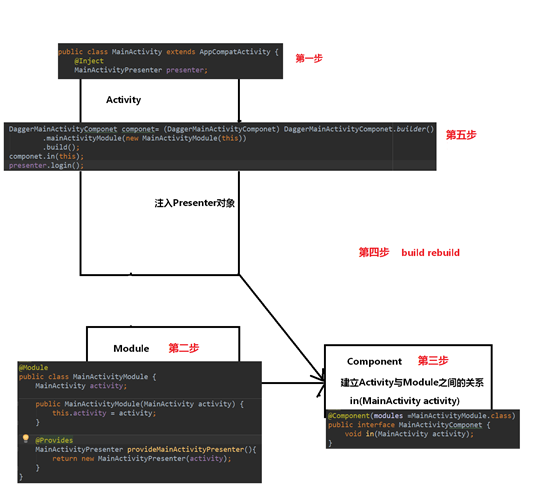
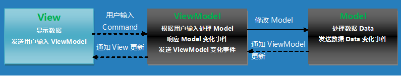
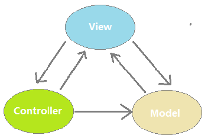
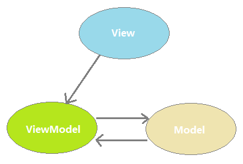
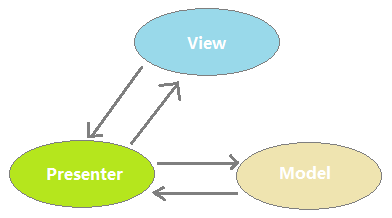

## 1. MVC设计模式
### 1.1 概述

模型-视图-控制器，MVC设计模式的目的是将数据模型和视图分离开来，并以控制器作为连接两者的桥梁以实现解耦


| 意义   | 说明                                       |
| :--- | :--------------------------------------- |
| M    | Model，表示模型层，数据模型或业务模型，就是我们要显示给用户查看的内容    |
| V    | View，表示视图层，就是用户直接看到的界面，例如：Activity，Fragment，自定义View，还有XML布局文件 |
| C    | Controler，表示控制层，用于模型和视图间切换数据，对应于Activity业务逻辑，数据处理和UI处理 |

而J2EE中的MVC分别表示：

- M：javabean
- V：jsp
- C：servlet

三角关系的问题就是维护问题。在MVC，当你有变化的时候你需要同时维护三个对象和三个交互，这显然让事情复杂化了

Android中经常会出现数千行的Activity代码，究其原因，Android中纯粹作为View的各个XML视图功能太弱，Activity基本上都是View和Controller的合体，既要负责视图的显示又要加入控制逻辑，承担的功能过多，代码量大也就不足为奇。所以更贴切的目前常规的开发说应该是View-Model 模式，大部分都是通过Activity的协调，连接，和处理逻辑的

Activity中存在两部分内容：业务相关和界面相关，V中的内容较少，而C中的内容较多

解决方案：将Activity中的业务部分拆分----MVP，将Activity中的界面部分拆分----MVVM

### 1.2 案例分析
Android中的ListView就用到了MVC设计模式

- M：数据的集合，List&lt;UserInfo>
- V：ListView
- C：Adapter，控制数据如何显示在ListView上

而Activity控制层和视图层都有

数据模型，业务层，业务逻辑，数据层，表现层，控制层：事件路由

## 2. MVP设计模式

MVP模式可以分离显示层和逻辑层，它们之间通过接口进行通信，降低耦合。MVP能够有效降低View复杂性，避免业务逻辑塞进View中，使得View变成一个混乱的“大泥坑”。


| 意义        | 说明                                    |
| :-------- | :------------------------------------ |
| Model     | 数据的存取，提供数据的存取功能，依然是实体模型               |
| View      | 用户界面，对应于Activity和xml，负责View的绘制以及与用户交互 |
| Presenter | 交互中间人，负责完成View于Model间的交互和业务逻辑         |

利用MVP的设计模型可以把部分的逻辑代码从Fragment和Activity业务的逻辑移出来，在Presenter中持有View（Activity或者Fragment）的引用，然后在Presenter调用View暴露的接口对视图进行操作，这样有利于把视图操作和业务逻辑分开来。MVP能够让Activity成为真正的View而不是View和Controler的合体，Activity只做UI相关的事。但是这个模式还是存在一些不好的地方，比较如说：

- Activity需要实现各种跟UI相关的接口，同时要在Activity中编写大量的事件，然后在事件处理中调用Presenter的业务处理方法，View和Presenter只是互相持有引用并互相做回调,代码不美观。

- 这种模式中，程序的主角是UI，通过UI事件的触发对数据进行处理，更新UI就要考虑线程的问题。而且UI改变后牵扯的逻辑耦合度太高，一旦控件更改（比较TextView 替换 EditText等）牵扯的更新UI的接口就必须得换。

- 复杂的业务同时会导致Presenter层太大，代码臃肿的问题。

切断的View和Model的联系，让View只和Presenter（原Controller）交互，减少在需求变化中需要维护的对象的数量。MVP定义了Presenter和View之间的接口，让一些可以根据已有的接口协议去各自分别独立开发，以此去解决界面需求变化频繁的问题

MVP模式是MVC模式的一个演化版本，MVP全称Model-View-Presenter。目前MVP在Android应用开发中越来越重要了。解耦view和model层

在Android中，业务逻辑和数据存取是紧紧耦合的，很多缺乏经验的开发者很可能会将各种各样的业务逻辑塞进某个Activity、Fragment或者自定义View中，这样会使得这些组件的单个类型臃肿不堪。如果不将具体的业务逻辑抽离出来，当UI变化时，你就需要去原来的View中抽离具体业务逻辑，这必然会很麻烦并且易出错。

对于view层和presenter层的通信，我们是可以通过接口实现的，具体的意思就是说我们的activity，fragment可以去实现实现定义好的接口，而在对应的presenter中通过接口调用方法。

将activity中的业务部分拆分—mvp，使用接口实现view和presenter的通信和隔离，这种方式有一个缺点，就是接口会非常多

将activity中的界面相关内容拆分—mvvm

### 2.1 使用MVP的好处

MVP模式会解除View与Model的耦合，有效的降低View的复杂性。同时又带来了良好的可扩展性、可测试性，保证系统的整洁性和灵活性。

MVP模式可以分离显示层与逻辑层，它们之间通过接口进行通信，降低耦合。理想化的MVP模式可以实现同一份逻辑代码搭配不同的显示界面，因为它们之间并不依赖于具体，而是依赖于抽象。这使得Presenter可以运用于任何实现了View逻辑接口的UI，使之具有更广泛的适用性，保证了灵活度。

让UI界面和数据分离

### 2.2 MVP模式的三个角色

- Presenter – 交互中间人

Presenter主要作为沟通View与Model的桥梁，它从Model层检索数据后，返回给View层，使得View与Model之间没有耦合，也将业务逻辑从View角色上抽离出来。负责完成View于Model间的交互和业务逻辑

- View – 用户界面

View通常是指Activity、Fragment或者某个View控件，它含有一个Presenter成员变量。通常View需要实现一个逻辑接口，将View上的操作转交给Presenter进行实现，最后，Presenter 调用View逻辑接口将结果返回给View元素。对应于Activity和xml，负责View的绘制以及与用户交互

- Model – 数据的存取

Model 角色主要是提供数据的存取功能。Presenter 需要通过Model层存储、获取数据，Model就像一个数据仓库。更直白的说，Model是封装了数据库DAO或者网络获取数据的角色，或者两种数据方式获取的集合。

### 2.3 MVP的实现


角色介绍 :

- User Interface : 用户界面，通过接口抽象函数功能，解除Presenter与具体UI的耦合
- Presenters : 业务逻辑层，作为UI与Model、网络操作的中间人，接触业务逻辑与UI的耦合
- Network : 网络操作层，处理http请求
- Models : 数据的增删改查操作，例如数据库操作
- Database : 数据持久层，SQLite

使用MVP架构模式，将业务逻辑与UI、数据操作隔离开来，保持灵活性，拥抱变化。

### 2.4 Dagger2

依赖注入是面向对象编程的一种设计模式，其目的是为了降低程序耦合，这个耦合就是类之间的依赖引起的。

#### 什么是Dagger2?

Dagger是为Android和Java平台提供的在编译时进行依赖注入的框架。
编译时：编译时生成代码（rebulid），我们完成所需对象的注入。（假设使用反射，应该是什么时候起作用?）。

#### 为什么使用Dagger2?

Dagger2解决了基于反射带来的开发和性能上的问题。

#### 做什么工作？

Dagger2主要用于做界面和业务之间的隔离

#### 引入配置

1、添加dagger2的依赖
```
compile 'com.google.dagger:dagger:2.6'
```
2、编译时生成代码的插件配置（android-apt）

- project的gradle中添加

```
buildscript {
		dependencies {
  			classpath 'com.neenbedankt.gradle.plugins:android-apt:1.8'
		}
}
```
- apt插件的使用

modle的gradle中添加

```
apply plugin: 'com.neenbedankt.android-apt'
```
- 关联Dagger2

```
dependencies {
	apt 'com.google.dagger:dagger-compiler:2.6'
}
```
#### 操作步骤



```java
// 第一步
public class MainActivity extends AppCompatActivity{
	@Inject
	MainActivityPresenter presenter;
}

// 第二步

@Module
public class  MainActivityModule{
  MainActivity activity;
  
  public MainActivityModule(MainActivity activity){
  	this.activity = activity;  
  }
  
  @provides
  MainActivityPresenter provideMainActivityPresenter(){
    return new MainActivityPresenter(activity);
  }
}

// 第三步
// Component，建立Activity和Module之间的关系
// in(MainActivity activity)

@Component(module = MainActivityModule.class)

public interface MainActivityComponent{
  void inject(MainActivity activity);
}
// 第四步 build rebuild

// 第五步 注入presenter对象
DaggerMainActivityComponent component = (DaggerMainActivityComponent)DaggerMainActivityComponent.builder()
	.mainActivityModule(new MainActivityModule(this))
	.build();
component.in(this);
presenter.login();
```

### 深入解析

在操作中会使用到@Inject、@Module、@Provides、@Conponent注解，那么他们分别在完成什么工作?


| 注解         | 功能说明                                     |
| :--------- | :--------------------------------------- |
| @Inject    | 当看到某个类被@Inject标记时，就会到他的构造方法中，如果这个构造方法也被@Inject标记的话，就会自动初始化这个类，从而完成依赖注入 |
| @Conponent | 用来将@Inject和@Module联系起来的桥梁，从@Module中获取依赖并将依赖注入给@Inject。一个接口或者抽象类，在这个接口中定义了一个inject()方法，rebuild一下项目，会生成一个以Dagger为前缀的Component类。 |
| @Module    | 用来提供依赖，为那些没有构造函数的类提供依赖，比如第三方类库，系统类。里面定义一些用@Provides注解的以provide开头的方法，这些方法就是所提供的依赖，Dagger2会在该类中寻找实例化某个类所需要的依赖 |
| @Provides  | Module中的创建类实例方法用Provides进行标注             |
| @Qualifier | 通过自定义Qulifier，可以告诉Dagger2去需找具体的依赖提供者。 帮助我们去为相同接口的依赖创建“tags” |
| @Scope     | 在作用域内保持单例，可以直接理解为单例即可。同属于一个作用域的时候会公用一个相同的实例 |
| @MapKey    | 这个注解用在定义一些依赖集合                           |
| @Singleton | @Singleton并不是我们设计模式中的单例模式，而是Dagger2中为了保持一个产品在一个Scope中只有一个对象的标签 |
### Component

Component需要引用到目标类的实例，Component会查找目标类中用Inject注解标注的属性，查找到相应的属性后会接着查找该属性对应的用Inject标注的构造函数，剩下的工作就是初始化该属性的实例并把实例进行赋值

一端连接目标类，另一端连接目标类依赖实例，它把目标类依赖实例注入到目标类中。Module是一个提供类实例的类，所以Module应该是属于Component的实例端的（连接各种目标类依赖实例的端），Component的新职责就是管理好Module，Component中的modules属性可以把Module加入Component，modules可以加入多个Module

### Module

项目中使用到了第三方的类库，第三方类库又不能修改，所以根本不可能把Inject注解加入这些类中，这时我们的Inject就失效了。

Module里面的方法基本都是创建类实例的方法。

### Provides

Module中的创建类实例方法用Provides进行标注，Component在搜索到目标类中用Inject注解标注的属性后，Component就会去Module中去查找用Provides标注的对应的创建类实例方法，这样就可以解决第三方类库用dagger2实现依赖注入了

### Qualifier

限定符：解决依赖注入迷失问题

```java
@Qualifier
@Retention(RetentionPolicy.RUNTIME)
public @interface A {}
```

```java
@Qualifier
@Retention(RetentionPolicy.RUNTIME)
public @interface B {}
```

我们定义了两个注解，@A和@B，他们都是用@Qulifiier标注的

再看看我们的Module

```java
@Module
public class SimpleModule {
    @Provides
    @A
    Cooker provideCookerA(){
        return new Cooker("James","Espresso");
    }
    @Provides
    @B
    Cooker provideCookerB(){
        return new Cooker("Karry","Machiato");
    }
    }
```

再看看具体的使用

```java
public class ComplexMaker implements CoffeeMaker {
    Cooker cookerA;
    Cooker cookerB;
    @Inject
    public ComplexMaker(@A Cooker cookerA,@B Cooker cookerB){
        this.cookerA = cookerA;
        this.cookerB = cookerB;
    }
    @Override
    public String makeCoffee() {
        return cooker.make();
    }
    }

cookerA.make();//James make Espresso
cookerB.make();//Karry make Machiato
```

### Singleton单例

### Scope作用域

- 自定义注解限定注解作用域


- 更好的管理Component之间的组织方式，Component组织方式：依赖方式dependencies、包含方式SubComponent
- 更好的管理Component与Module之间的匹配关系

```java
@Scope
@Retention(RetentionPolicy.RUNTIME)
public @interface PerActivity {
}
```

```java
@PerActivity
@Component(modules = {ActivityModule.class})
public interface ActivityComponent {

    Activity getActivity();
}
```

### SubComponent

以包含方式组织Component之间的关系

```java
@PerActivity
@Subcomponent
public interface MainFragmentComponent {
    void inject(MainFragment mainFragment);
}
```

```java
@PerActivity
@Component(dependencies = AppComponent.class,modules = {MainModule.class, ActivityModule.class})
public interface MainComponent extends ActivityComponent{
    //对MainActivity进行依赖注入
    void inject(MainActivity mainActivity);
    MainFragmentComponent mainFragmentComponent();
}
```

```java
MainActivityPresenter presenter = new MainActivityPresenter(this);

MainActivity_MembersInjector

public void injectMembers(MainActivity instance) {
  if (instance == null) {
  ……  }
  instance.presenter = presenterProvider.get();
}
```

其实，Dagger2在使用这几个注解解决三个问题。

- 创建对象的代码放到那里去了？
- 创建好的对象给谁（指定接收者）？
- 如何将创建好的对象赋值给接收者？

指定创建对象的类（组件）和方法

- @Module：指定创建对象的类
- @Provides：指定创建对象的方法

初始时：

```java
public class MainActivityModule {
  public String createString(){
    return new String(“itheima”);
  }
}
```
添加注解后：
```java
@Moudle
public class MainActivityModule {
  @Provides
  public String createString(){
    return new String(“itheima”);
  }
}
```
指定接收者：创建好的对象需要赋值给指定的目标，我们需要通过@Inject注解告知Dagger2容器，把已经创建好的对象赋值给谁。
```java
public class MainActivity…..{
  @Inject
  String target;
}
```
将接收者和创建好的对象联系在一起：通过@Component来指定工作由哪个接口完成，通过这个接口我们可以看到组件和接收者。

## 3. MVVM设计模式



| 意义        | 说明                                       |
| :-------- | :--------------------------------------- |
| Model     | 实体模型，代表基本业务逻辑                            |
| View      | 对应于Activity和xml，负责View的绘制以及与用户交互         |
| ViewModel | 将view和model联系在一起，起到桥梁的作用，负责完成View于Model间的交互,负责业务逻辑 |

MVVM的目标和思想MVP类似，利用数据绑定(Data Binding)、依赖属性(Dependency Property)、命令(Command)、路由事件(Routed Event)等新特性，打造了一个更加灵活高效的架构。

ViewModel大致上就是MVP的Presenter和MVC的Controller了，而View和ViewModel间没有了MVP的界面接口，而是直接交互，用数据“绑定”的形式让数据更新的事件不需要开发人员手动去编写特殊用例，而是自动地双向同步。比起MVP，MVVM不仅简化了业务与界面的依赖关系，还优化了数据频繁更新的解决方案，甚至可以说提供了一种有效的解决模式。

可以直接在layout布局xml中绑定数据，分离视图与业务逻辑，低耦合，可重用，独立开发，可测试

View和Model进行双向绑定（data binding），View的变化可以自动的反应在ViewModel，ViewModel的数据变化也会自动反应到View上，data binding框架解决了数据绑定的问题

- 数据驱动

在MVVM中，以前开发模式中必须先处理业务数据，然后根据的数据变化，去获取UI的引用然后更新UI，也是通过UI来获取用户输入，而在MVVM中，数据和业务逻辑处于一个独立的View Model中，ViewModel只要关注数据和业务逻辑，不需要和UI或者控件打交道。由数据自动去驱动UI去自动更新UI，UI的改变又同时自动反馈到数据，数据成为主导因素，这样使得在业务逻辑处理只要关心数据，方便而且简单很多。

- 低耦合度

MVVM模式中，数据是独立于UI的，ViewModel只负责处理和提供数据，UI想怎么处理数据都由UI自己决定，ViewModel 不涉及任何和UI相关的事也不持有UI控件的引用，即使控件改变（TextView 换成 EditText）ViewModel 几乎不需要更改任何代码，专注自己的数据处理就可以了，如果是MVP遇到UI更改，就可能需要改变获取UI的方式，改变更新UI的接口，改变从UI上获取输入的代码，可能还需要更改访问UI对象的属性代码等等。

- 更新 UI

在MVVM中，我们可以在工作线程中直接修改View Model的数据（只要数据是线程安全的），剩下的数据绑定框架帮你搞定，很多事情都不需要你去关心。

- 团队协作

MVVM的分工是非常明显的，由于View和View Model之间是松散耦合的。一个是处理业务和数据，一个是专门的UI处理。完全有两个人分工来做，一个做UI（xml 和 Activity）一个写ViewModel，效率更高。

- 可复用性

一个View Model复用到多个View中，同样的一份数据，用不同的UI去做展示，对于版本迭代频繁的UI改动，只要更换View层就行，对于如果想在UI上的做AbTest 更是方便的多。

- 单元测试

View Model里面是数据和业务逻辑，View中关注的是UI，这样的做测试是很方便的，完全没有彼此的依赖，不管是UI的单元测试还是业务逻辑的单元测试，都是低耦合的。

通过上面对MVVM的简述和其他两种模式的对比，我们发现MVVM对比MVC和MVP来说还是存在比较大的优势，虽然目前Android开发中可能真正在使用MVVM的很少.

通过一系列的学习，消化和参考。目前，MVC，MVP都已经应用到项目开发中了。
关于MVVM目前是只闻其声，不见其下楼。MVVM算是舶来品，从Web前端的Argular而来。Argular有个databind的属性领我们羡慕不已，瞬间感觉高大上啊！

其实，还有WPF，这个落寞巨人微软的背影。这个有个点感觉很牛逼就是，界面开发和业务开发完全分开实现。界面开发除了数据是假的，业务操作绑定，显示全是真的，业务流程的定义和界面设计进行了解耦，二者通过接口文档，默认命名规则进行约定实现。最后界面显示和业务处理拼合起来就好了。

我觉得除了databind （现在有robobinding可以参考），还需要 有事件订阅与发布 的模块（推荐使用使用facebook的flux），相关技术用到RxJava，RxAndroid的模块。

而后再加上代码自动生成，通过web服务器的数据库，直接生成业务处理代码与接口，Android端也自动生成业务处理类。着多牛逼啊，然后Android开发失业。web开发失业。数据库设计和界面开发笑到了最后。

这都是我们对于mvvm的自嗨和幻想+YY，Google大兄弟目前还没有推荐的技术实现。感觉Google处境很尴尬，现在Facebook 推出的 React Native 如日中天，大有替代Java 原生编程的趋势。如果真取代了，Android Application 将是 Node.js JavaScript的乐园。我们原生应用的开发工程师可要下岗了。目前已经在不断蚕食Android原生开发的份额，通过Cordova这个内奸，Html5家族由原来的jQuery Mobile 到 Augular.js 和ionic，再到 React 和 React Native，来势汹汹。JS是如日中天，蓬勃发展。再回来讨论MVVM竟然是前端带来的技术。遇见的未来竞争会更激烈。广大Android原生开发的从业者受的的冲击会更大。

MVC特点

- 用户可以向View发送指令， 再由View直接要求Model改变状态
- 用户也可以直接向Controller发送指令，再由Controller发送给View
- Controller起到事件路由的作用，同时业务逻辑也都部署在Controller中

MVVM的特点

MVVM与MVP非常相似，唯一的区别是View和Model进行双向绑定（data binding），两者之间有一方发生变化则会反应到零一方上。而MVP与MVVM的主要区别是，MVP中的View更新需要通过Presenter，而MVVM则不需要，因为View和Model进行双向绑定，数据的修改会直接反应到View上，而View的修改也会导致数据的变更。此时，ViewModel需要做的只是业务逻辑的处理，以及修改修改View和Model的状态。MVVM模式有点像ListView和Adapter、数据集的关系，这个Adapter就是ViewModel的角色，它与View进行了绑定，又与数据集进行了绑定，当数据集合发生变化时，调用Adapter的notifyDataSetChange()之后View就直接更新了，它们直接没有直接的耦合，使得ListView变得更为灵活。

   

### DataBinding

为什么使用databinding——解决数据传输问题

#### 开启DataBinding

由于AndroidStudio已经默认集成了DataBinding，所以我们只需要将开关打开即可。在应用的build.grandle中添加开启配置

```gradle
android {
    ....
    dataBinding {
        enabled = true
    }
}
```

### Data Binding 中的布局文件入门

#### 1. 编写 data binding 表达式
DataBinding 的布局文件与以前的布局文件有一点不同。它以一个 layout 标签作为根节点，里面包含一个 data 标签与 view 标签。view 标签的内容就是不使用 data binding 时的普通布局文件内容。例子如下：

```xml
<?xml version="1.0" encoding="utf-8"?>
<layout xmlns:android="http://schemas.android.com/apk/res/android">
   <data>
       <variable name="user" type="com.example.User"/>
   </data>
   <LinearLayout
       android:orientation="vertical"
       android:layout_width="match_parent"
       android:layout_height="match_parent">
       <TextView android:layout_width="wrap_content"
           android:layout_height="wrap_content"
           android:text="@{user.firstName}"/>
       <TextView android:layout_width="wrap_content"
           android:layout_height="wrap_content"
           android:text="@{user.lastName}"/>
   </LinearLayout>
</layout>
```
在 data 标签中定义的 user 变量描述了一个可以在布局中使用的属性
```xml
<variable name="user" type="com.example.User"/>
```
在布局文件中写在属性值里的表达式使用 “@{}” 的语法。在这里，TextView 的文本被设置为 user 中的 firstName 属性。
```xml
<TextView android:layout_width="wrap_content"
          android:layout_height="wrap_content"
          android:text="@{user.firstName}"/>
```

#### 2. 数据对象
假设你有一个 plain-old Java object(POJO) 的 User 对象。
```java
public class User {
   public final String firstName;
   public final String lastName;
   public User(String firstName, String lastName) {
       this.firstName = firstName;
       this.lastName = lastName;
   }
}
```
这个类型的对象拥有不可改变的数据(immutable)。在应用中，写一次之后永不变动数据的对象很常见。这里也可以使用 JavaBeans 对象：
```java
public class User {
   private final String firstName;
   private final String lastName;
   public User(String firstName, String lastName) {
       this.firstName = firstName;
       this.lastName = lastName;
   }
   public String getFirstName() {
       return this.firstName;
   }
   public String getLastName() {
       return this.lastName;
   }
}
```
从 data binding 的角度看，这两个类是等价的。用于 TextView 的`android:text`属性的表达式`@{user.firstName}`，对于 POJO 对象会读取 firstName 字段，对于 JavaBeans 对象会调用 getFirstName() 方法。此外，如果 user 中有 firstName() 方法存在的话，也可以使用@{user.firstName}表达式调用。

#### 3. 绑定数据
3.1 数据绑定工具在编译时会基于布局文件生成一个 Binding 类。默认情况下，这个类的名字将基于布局文件的名字产生，把布局文件的名字转换成帕斯卡命名形式并在名字后面接上”Binding”。例如，上面的那个布局文件叫 main_activity.xml，所以会生成一个 MainActivityBinding 类。这个类包含了布局文件中所有的绑定关系（user 变量和user表达式），并且会根据绑定表达式给布局文件中的 View 赋值。

在 inflate 一个布局的时候创建 binding 的方法如下：

```java
@Override
protected void onCreate(Bundle savedInstanceState) {
   super.onCreate(savedInstanceState);
   MainActivityBinding binding = DataBindingUtil.setContentView(this, R.layout.main_activity);
   User user = new User("Test", "User");
   binding.setUser(user);
}
```
就这么简单！运行应用，你会发现测试信息已经显示在界面中了。

3.2 你也可以通过以下这种方式绑定view：
```java
MainActivityBinding binding = MainActivityBinding.inflate(getLayoutInflater());
```
MainActivityBinding.inflate() 会填充 MainActivityBinding 对应的布局，并创建 MainActivityBinding 对象，把布局和MainActivityBinding对象绑定起来。

3.3 如果在 ListView 或者 RecyclerView 的 adapter 中使用 data binding，可以这样写：
```java
ListItemBinding binding = ListItemBinding.inflate(layoutInflater, viewGroup, false);
//or
ListItemBinding binding = DataBindingUtil.inflate(layoutInflater, R.layout.list_item, viewGroup, false);
```

#### 4. 事件处理
数据绑定允许你编写表达式来处理view分发的事件（比如 onClick）。事件属性名字取决于监听器方法名字。例如[View.OnLongClickListener](https://developer.android.com/reference/android/view/View.OnLongClickListener.html)有[onLongClick()](https://developer.android.com/reference/android/view/View.OnLongClickListener.html#onLongClick(android.view.View))的方法，因此这个事件的属性是android:onLongClick
。处理事件有两种方法：

- 方法引用绑定：在您的表达式中，您可以引用符合监听器方法签名的方法。当表达式的值为方法引用时，Data Binding会创建一个侦听器中封装方法引用和方法所有者对象，并在目标视图上设置该侦听器。如果表达式的值为null，数据绑定则不会创建侦听器，而是设置一个空侦听器。

- Lisenter 绑定：如果事件处理表达式中包含lambda表达式。数据绑定一直会创建一个监听器，设置给视图。当事件分发时，侦听器才会计算lambda表达式的值。

##### 4.1. 方法引用绑定

事件可以直接绑定到处理器的方法上，类似于`android：onClick`可以分配一个Activity中的方法。与`View＃onClick`属性相比，方法绑定一个主要优点是表达式在编译时就处理了，因此如果该方法不存在或其签名不正确，您会收到一个编译时错误。 

方法引用绑定和监听器绑定之间的主要区别是，包裹方法引用的监听器是在数据绑定时创建的，包裹监听器绑定是在触发事件时创建的。如果您喜欢在事件发生时执行表达式，则应使用监听器绑定。 

要将事件分配给其处理程序，使用正常的绑定表达式，该值是要调用的方法名称。例如，如果数据对象有两个方法：

```java
public class MyHandlers {
    public void onClickFriend(View view) { ... }
}
```
像下面这样，绑定表达式可以为视图分配一个点击监听器：
```xml
<?xml version="1.0" encoding="utf-8"?>
<layout xmlns:android="http://schemas.android.com/apk/res/android">
   <data>
       <variable name="handlers" type="com.example.Handlers"/>
       <variable name="user" type="com.example.User"/>
   </data>
   <LinearLayout
       android:orientation="vertical"
       android:layout_width="match_parent"
       android:layout_height="match_parent">
       <TextView android:layout_width="wrap_content"
           android:layout_height="wrap_content"
           android:text="@{user.firstName}"
           android:onClick="@{handlers::onClickFriend}"/>
   </LinearLayout>
</layout>
```
请注意，表达式中的方法签名必须与监听器对象中的方法签名完全匹配。

##### 4.2. Lisenter 绑定

Lisenter 绑定是在应用程序运行中事件发生时才绑定表达式。它们和方法引用绑定类似，但Listener 绑定允许运行时的任意数据绑定表达式。此功能适用于版本2.0及更高版本的Android Gradle插件。 

在方法引用绑定中，方法的参数必须与事件侦听器的参数匹配。在Listener 绑定中，只要返回值必须与Lisenter的预期返回值匹配（除非它期望void）。

例如，您可以有一个presenter类，它具有以下方法：
```java
public class Presenter {
    public void onSaveClick(Task task){}
}
```
然后，您可以将点击事件绑定到您的类中，如下所示：
```xml
<?xml version="1.0" encoding="utf-8"?>
<layout xmlns:android="http://schemas.android.com/apk/res/android">
  <data>
      <variable name="task" type="com.android.example.Task" />
      <variable name="presenter" type="com.android.example.Presenter" />
  </data>
  <LinearLayout 
    android:layout_width="match_parent" 
    android:layout_height="match_parent">
      <Button 
        android:layout_width="wrap_content" 
        android:layout_height="wrap_content"
        android:onClick="@{() -> presenter.onSaveClick(task)}" />
  </LinearLayout>
</layout>
```
侦听器由只允许由作为表达式的根元素的lambda表达式表示。当在表达式中使用回调时，数据绑定自动创建必要的侦听器并且为事件注册。当视图触发事件时，数据绑定将执行给定的表达式。与在正则绑定表达式中一样，在执行这些侦听器表达式时，仍然会获得数据绑定的空值和线程安全性。

注意，在上面的示例中，我们没有在ambda表达式中定义传递到 onClick（android.view.View）的视图参数。侦听器绑定为侦听器参数提供两个选择：忽略方法的所有参数和命名所有参数。如果您喜欢命名参数，可以在表达式中使用它们。例如，上面的表达式可以写成：
```
android:onClick="@{(view) -> presenter.onSaveClick(task)}"
```
如果你想要使用表达式中的参数，可以在这样使用：
```java
public class Presenter {
    public void onSaveClick(View view, Task task){}
}
```
```
android:onClick="@{(theView) -> presenter.onSaveClick(theView, task)}"
```
您也可以使用具有多个参数的lambda表达式：
```java
public class Presenter {
    public void onCompletedChanged(Task task, boolean completed){}
}
```
```xml
<CheckBox 
    android:layout_width="wrap_content" 
    android:layout_height="wrap_content"
    android:onCheckedChanged="@{(cb, isChecked) -> presenter.completeChanged(task, isChecked)}" />
```
如果正在侦听的事件返回类型不是void的值，则表达式也必须返回相同类型的值。例如，如果你想监听长点击事件，你的表达式应该返回布尔值。
```java
public class Presenter {
    public boolean onLongClick(View view, Task task){}
}
```
```
android:onLongClick="@{(theView) -> presenter.onLongClick(theView, task)}"
```
如果由于空对象而无法计算表达式，数据绑定将返回该类型的默认Java值。例如，引用类型为null，int为0，boolean为false等。 如果需要使用带谓词（例如三元）的表达式，则可以使用void作为符号。
```
android:onClick="@{(v) -> v.isVisible() ? doSomething() : void}"
```
##### 4.3. 避免复杂侦听器

Listener表达式非常强大，可以使您的代码非常容易阅读。另一方面，包含复杂表达式的 Listener 又会使您的布局难以阅读和难以维护。这些表达式应该像从UI传递可用数据到回调方法一样简单。您应该在从侦听器表达式调用的回调方法中实现任何业务逻辑。 

一些专门的点击事件处理程序存在，他们需要一个属性，而不是android:onClick避免冲突。已创建以下属性以避免此类冲突。

| Class        | Listener Setter                          | Attribute             |
| :----------- | :--------------------------------------- | :-------------------- |
| SearchView   | setOnSearchClickListener(View.OnClickListener) | android:onSearchClick |
| ZoomControls | setOnZoomInClickListener(View.OnClickListener) | android:onZoomIn      |
| ZoomControls | setOnZoomOutClickListener(View.OnClickListener) | android:onZoomOut     |

##  Data Binding 中的布局文件进阶
### 1. import
1.1 data标签内可以有0个或者多个 import 标签。你可以在布局文件中像使用 Java 一样导入引用。
```xml
<data>
    <import type="android.view.View"/>
</data>
```
导入的类有两种用处，一种是用来定义变量，一种是在表达式中访问类中的静态方法和属性
现在 View 可以被在表达式中这样引用：
```xml
<TextView
   android:text="@{user.lastName}"
   android:layout_width="wrap_content"
   android:layout_height="wrap_content"
   android:visibility="@{user.isAdult ? View.VISIBLE : View.GONE}"/>
```
1.2 当类名发生冲突时，可以使用 alias：
```xml
<import type="android.view.View"/>
<import type="com.example.real.estate.View"
        alias="Vista"/>
```
现在，Vista 可以用来引用 com.example.real.estate.View ，与 View 在布局文件中同时使用。

1.3 导入的类型可以用于变量的类型引用和表达式中：
```xml
<data>
    <import type="com.example.User"/>
    <import type="java.util.List"/>
    <variable name="user" type="User"/>
    <variable name="userList" type="List<User>"/>
</data>
```
> 注意：Android Studio 还没有对导入提供自动补全的支持。你的应用还是可以被正常编译，要解决这个问题，你可以在变量定义中使用完整的包名。

```xml
<TextView
   android:text="@{((User)(user.connection)).lastName}"
   android:layout_width="wrap_content"
   android:layout_height="wrap_content"/>
```
1.4 导入的类也可以在表达式中使用静态属性/方法:

```xml
<data>
    <import type="com.example.MyStringUtils"/>
    <variable name="user" type="com.example.User"/>
</data>
…
<TextView
   android:text="@{MyStringUtils.capitalize(user.lastName)}"
   android:layout_width="wrap_content"
   android:layout_height="wrap_content"/>
```

## 4. Demo

用MVC、MVP和MVVM分别实现登录界面的功能


### 4.1 MVC

布局文件

```xml
<?xml version="1.0" encoding="utf-8"?>
<LinearLayout xmlns:android="http://schemas.android.com/apk/res/android"
    xmlns:tools="http://schemas.android.com/tools"
    android:layout_width="match_parent"
    android:layout_height="match_parent"
    android:orientation="vertical"
    android:paddingBottom="@dimen/activity_vertical_margin"
    android:paddingLeft="@dimen/activity_horizontal_margin"
    android:paddingRight="@dimen/activity_horizontal_margin"
    android:paddingTop="@dimen/activity_vertical_margin"
    >

    <LinearLayout
        android:layout_width="match_parent"
        android:layout_height="wrap_content"
        android:gravity="center"
        android:orientation="horizontal">

        <TextView
            android:layout_width="wrap_content"
            android:layout_height="wrap_content"
            android:text="Username:" />

        <EditText
            android:id="@+id/username"
            android:layout_width="200dp"
            android:layout_height="wrap_content" />
    </LinearLayout>

    <LinearLayout
        android:layout_width="match_parent"
        android:layout_height="wrap_content"
        android:layout_marginTop="20dp"
        android:gravity="center"
        android:orientation="horizontal">

        <TextView
            android:layout_width="wrap_content"
            android:layout_height="wrap_content"
            android:text="Password:" />

        <EditText
            android:id="@+id/password"
            android:layout_width="200dp"
            android:layout_height="wrap_content" />
    </LinearLayout>

    <Button
        android:id="@+id/login"
        android:layout_width="wrap_content"
        android:layout_height="wrap_content"
        android:layout_gravity="center"
        android:layout_marginTop="20dp"
        android:onClick="login"
        android:text="login" />
</LinearLayout>
```
MainActivity.java
```java
package cn.itcast.architecture;

import android.app.Activity;
import android.app.ProgressDialog;
import android.os.SystemClock;
import android.support.v7.app.AppCompatActivity;
import android.os.Bundle;
import android.text.TextUtils;
import android.view.View;
import android.widget.EditText;
import android.widget.Toast;

import cn.itcast.architecture.bean.User;
import cn.itcast.architecture.net.UserLoginNet;

public class MainActivity extends AppCompatActivity {
    /*

    流程：
    1、界面展示
    2、用户的输入
    3、按钮点击
    4、判断用户输入
    5、显示滚动条
    6、一系列耗时工作
    7、隐藏
    8、提示用户

    MainActivity中处理所有代码
    按照MVC模式拆分

    存在问题：
    Activity中存在两部分内容：业务相关+界面相关
    V中的内容相对较少而C中的内容很多
    解决方案：
    1、如果将Activity中的业务部分拆分——MVP
    2、如果将Activity中的界面相关内容拆分——MVVM
     */

    private EditText mUsername;
    private EditText mPassword;
    private ProgressDialog dialog;

    @Override
    protected void onCreate(Bundle savedInstanceState) {
        super.onCreate(savedInstanceState);
        setContentView(R.layout.activity_main);
        mUsername = (EditText) findViewById(R.id.username);
        mPassword = (EditText) findViewById(R.id.password);
        dialog = new ProgressDialog(this);
    }

    /**
     * 按钮点击
     * @param view
     */
    public void login(View view) {
        final String username = mUsername.getText().toString();
        final String password = mPassword.getText().toString();
        final User user=new User();
        user.username=username;
        user.password=password;
        boolean userInfo = checkUserInfo(user);
        if(userInfo){
            dialog.show();
            new Thread(){
                @Override
                public void run() {
                    UserLoginNet net=new UserLoginNet();

                    if(net.sendUserLoginInfo(user)){
                        runOnUiThread(new Runnable() {
                            @Override
                            public void run() {
                                // 登陆成功
                                dialog.dismiss();
                                Toast.makeText(MainActivity.this, "欢迎回来"+username, Toast.LENGTH_SHORT).show();
                            }
                        });

                    }else{
                        //登陆失败
                        runOnUiThread(new Runnable() {
                            @Override
                            public void run() {
                                // 登陆成功
                                dialog.dismiss();
                                Toast.makeText(MainActivity.this, "用户名或密码输入有误", Toast.LENGTH_SHORT).show();
                            }
                        });
                    }

                }
            }.start();
        }else{
            Toast.makeText(MainActivity.this, "用户名或密码不能为空", Toast.LENGTH_SHORT).show();
        }
    }

    /**
     * 判断用户输入
     * @param user
     * @return
     */
    private boolean checkUserInfo(User user) {
        if(TextUtils.isEmpty(user.username)||TextUtils.isEmpty(user.password)){
            return false;
        }
        return true;
    }
}
```
UserLoginNet.java，模拟网络请求
```java
package cn.itcast.architecture.net;

import android.os.SystemClock;
import android.widget.Toast;

import cn.itcast.architecture.bean.User;

public class UserLoginNet {

    /**
     * 发送用户输入数据
     * @param user
     * @return
     */
    public boolean sendUserLoginInfo(User user){
        SystemClock.sleep(2000);
        if("itcast".equals(user.username)&&"wuhan".equals(user.password)){
           return true;
        }else{
            //登陆失败
           return false;
        }
    }
}
```

```java
package cn.itcast.architecture.bean;

public class User {
    public String username;
    public String password;
}
```

### 4.2 MVP

MainActivity.java

```java
package cn.itcast.mvp;

import android.app.ProgressDialog;
import android.support.v7.app.AppCompatActivity;
import android.os.Bundle;
import android.view.View;
import android.widget.EditText;
import android.widget.Toast;

import cn.itcast.mvp.bean.User;
import cn.itcast.mvp.presenter.UserLoginPresenter;

public class MainActivity extends AppCompatActivity implements IUserLoginView{

    private EditText mUsername;
    private EditText mPassword;
    private ProgressDialog dialog;

    private UserLoginPresenter presenter;

    @Override
    protected void onCreate(Bundle savedInstanceState) {
        super.onCreate(savedInstanceState);
        setContentView(R.layout.activity_main);

        mUsername = (EditText) findViewById(R.id.username);
        mPassword = (EditText) findViewById(R.id.password);
        dialog = new ProgressDialog(this);

        presenter = new UserLoginPresenter(this);
    }

    /**
     * 按钮点击
     * @param view
     */
    public void login(View view) {
        final String username = mUsername.getText().toString();
        final String password = mPassword.getText().toString();
        final User user=new User();
        user.username=username;
        user.password=password;

        boolean userInfo = presenter.checkUserInfo(user);

        if(userInfo){
            dialog.show();
            presenter.login(user);
        }else{
            Toast.makeText(MainActivity.this, "用户名或密码不能为空", Toast.LENGTH_SHORT).show();
        }
    }

    /**
     * 登陆成功
     */
    public void success(){
        runOnUiThread(new Runnable() {
            @Override
            public void run() {
                // 登陆成功
                dialog.dismiss();
                Toast.makeText(MainActivity.this, "欢迎回来"+mUsername.getText().toString(), Toast.LENGTH_SHORT).show();
            }
        });
    }

    /**
     * 登陆失败
     */
    public void failed(){
        runOnUiThread(new Runnable() {
            @Override
            public void run() {
                // 登陆失败
                dialog.dismiss();
                Toast.makeText(MainActivity.this, "用户名或密码输入有误", Toast.LENGTH_SHORT).show();
            }
        });
    }
}
```
IUserLoginView.java
```java
package cn.itcast.mvp;

public interface IUserLoginView {
    /**
     * 登陆成功
     */
    void success();

    /**
     * 登陆失败
     */
    void failed();
}
```
UserLoginPresenter.java
```java
package cn.itcast.mvp.presenter;

import android.text.TextUtils;
import android.widget.Toast;

import cn.itcast.mvp.IUserLoginView;
import cn.itcast.mvp.MainActivity;
import cn.itcast.mvp.bean.User;
import cn.itcast.mvp.net.UserLoginNet;

public class UserLoginPresenter {
    // Activity 和 Fragment 通用性不好
    // 提高通用性：放置参数为通用（抽象类或接口，实际开发中接口更通用）
    private IUserLoginView view;
    public UserLoginPresenter(IUserLoginView view){
        this.view=view;
    }

    /**
     * 判断用户输入
     *
     * @param user
     * @return
     */
    public boolean checkUserInfo(User user) {
        if(TextUtils.isEmpty(user.username)||TextUtils.isEmpty(user.password)){
            return false;
        }
        return true;
    }

    /**
     * 用户登录
     * @param user
     */
    public void login(final User user){
        new Thread(){
            @Override
            public void run() {
                UserLoginNet net=new UserLoginNet();
                if(net.sendUserLoginInfo(user)){
                    // 登陆成功
                    view.success();
                }else{
                    //登陆失败
                    view.failed();
                }
            }
        }.start();
    }
}
```
UserLoginNet.java
```java
package cn.itcast.mvp.net;

import android.os.SystemClock;
import cn.itcast.mvp.bean.User;

public class UserLoginNet {

    /**
     * 发送用户输入数据
     * @param user
     * @return
     */
    public boolean sendUserLoginInfo(User user){
        SystemClock.sleep(2000);
        if("itcast".equals(user.username)&&"wuhan".equals(user.password)){
           return true;
        }else{
            //登陆失败
           return false;
        }
    }
}
```
User.java
```java
package cn.itcast.mvp.bean;

public class User {
    public String username;
    public String password;
}
```
### 4.3 MVVM

MVVM模式使用到Data Binding，需要在build.gradle文件中配置

```gradle
apply plugin: 'com.android.application'

android {
    compileSdkVersion 25
    buildToolsVersion "25.0.2"

    defaultConfig {
        applicationId "cn.itcast.mvvm"
        minSdkVersion 14
        targetSdkVersion 25
        versionCode 1
        versionName "1.0"
    }
    buildTypes {
        release {
            minifyEnabled false
            proguardFiles getDefaultProguardFile('proguard-android.txt'), 'proguard-rules.pro'
        }
    }
    dataBinding{
        enabled=true // 设置dataBinding为可用
    }
}

dependencies {
    compile fileTree(dir: 'libs', include: ['*.jar'])
    testCompile 'junit:junit:4.12'
    compile 'com.android.support:appcompat-v7:25.3.0'
}
```

布局文件

```xml
<?xml version="1.0" encoding="utf-8"?>
<layout  xmlns:android="http://schemas.android.com/apk/res/android">
    <data>
        <variable
            name="event"
            type="cn.itcast.mvvm.UserEvent" />
    </data>
<LinearLayout
    xmlns:tools="http://schemas.android.com/tools"
    android:layout_width="match_parent"
    android:layout_height="match_parent"
    android:orientation="vertical"
    android:paddingBottom="@dimen/activity_vertical_margin"
    android:paddingLeft="@dimen/activity_horizontal_margin"
    android:paddingRight="@dimen/activity_horizontal_margin"
    android:paddingTop="@dimen/activity_vertical_margin"
    >

    <LinearLayout
        android:layout_width="match_parent"
        android:layout_height="wrap_content"
        android:gravity="center"
        android:orientation="horizontal">

        <TextView
            android:layout_width="wrap_content"
            android:layout_height="wrap_content"
            android:text="Username:" />

        <EditText
            android:id="@+id/username"
            android:layout_width="200dp"
            android:layout_height="wrap_content"
            android:addTextChangedListener="@{event.usernameWatcher}"/>
    </LinearLayout>

    <LinearLayout
        android:layout_width="match_parent"
        android:layout_height="wrap_content"
        android:layout_marginTop="20dp"
        android:gravity="center"
        android:orientation="horizontal">

        <TextView
            android:layout_width="wrap_content"
            android:layout_height="wrap_content"
            android:text="Password:" />

        <EditText
            android:id="@+id/password"
            android:layout_width="200dp"
            android:layout_height="wrap_content"
            addTextChangedListener="@{event.passwordWatcher}"/>
    </LinearLayout>

    <Button
        android:id="@+id/login"
        android:layout_width="wrap_content"
        android:layout_height="wrap_content"
        android:layout_gravity="center"
        android:layout_marginTop="20dp"
        android:onClick="login"
        android:text="login" />
</LinearLayout>
</layout>
```
MainActivity.java
```java
package cn.itcast.mvvm;

import android.app.ProgressDialog;
import android.databinding.DataBindingUtil;
import android.os.Bundle;
import android.support.v7.app.AppCompatActivity;
import android.text.TextUtils;
import android.view.View;
import android.widget.EditText;
import android.widget.Toast;

import cn.itcast.mvvm.bean.User;
import cn.itcast.mvvm.databinding.ActivityMainBinding;
import cn.itcast.mvvm.net.UserLoginNet;


public class MainActivity extends AppCompatActivity {
    /*

    流程：
    1、界面展示
    2、用户的输入
    3、按钮点击
    4、判断用户输入
    5、显示滚动条
    6、一系列耗时工作
    7、隐藏
    8、提示用户

    MainActivity中处理所有代码
    按照MVC模式拆分

    存在问题：
    Activity中存在两部分内容：业务相关+界面相关
    V中的内容相对较少而C中的内容很多
    解决方案：
    1、如果将Activity中的业务部分拆分——MVP
    2、如果将Activity中的界面相关内容拆分——MVVM
     */

    private ProgressDialog dialog;
    private User user;

    @Override
    protected void onCreate(Bundle savedInstanceState) {
        super.onCreate(savedInstanceState);

        ActivityMainBinding binding = DataBindingUtil.setContentView(this, R.layout.activity_main);
        user = new User();
        UserEvent event=new UserEvent(user);
        binding.setEvent(event);

        dialog = new ProgressDialog(this);
    }

    /**
     * 按钮点击
     *
     * @param view
     */
    public void login(View view) {


        boolean userInfo = checkUserInfo(user);
        if(userInfo){
            dialog.show();
            new Thread(){
                @Override
                public void run() {
                    UserLoginNet net=new UserLoginNet();

                    if(net.sendUserLoginInfo(user)){
                        runOnUiThread(new Runnable() {
                            @Override
                            public void run() {
                                // 登陆成功
                                dialog.dismiss();
                                Toast.makeText(MainActivity.this, "欢迎回来"+user.username, Toast.LENGTH_SHORT).show();
                            }
                        });

                    }else{
                        //登陆失败
                        runOnUiThread(new Runnable() {
                            @Override
                            public void run() {
                                // 登陆成功
                                dialog.dismiss();
                                Toast.makeText(MainActivity.this, "用户名或密码输入有误", Toast.LENGTH_SHORT).show();
                            }
                        });
                    }

                }
            }.start();
        }else{
            Toast.makeText(MainActivity.this, "用户名或密码不能为空", Toast.LENGTH_SHORT).show();
        }
    }

    /**
     * 判断用户输入
     *
     * @param user
     * @return
     */
    private boolean checkUserInfo(User user) {
        if(TextUtils.isEmpty(user.username)||TextUtils.isEmpty(user.password)){
            return false;
        }
        return true;
    }
}
```
UserEvent.java
```java
package cn.itcast.mvvm;

import android.text.Editable;
import android.text.TextWatcher;

import cn.itcast.mvvm.bean.User;

public class UserEvent {

    private User user;
    public UserEvent(User user){
        this.user=user;
    }

    public TextWatcher usernameWatcher=new TextWatcher() {
        @Override
        public void beforeTextChanged(CharSequence s, int start, int count, int after) {

        }

        @Override
        public void onTextChanged(CharSequence s, int start, int before, int count) {

        }

        @Override
        public void afterTextChanged(Editable s) {
            user.username=s.toString();
        }
    };

    public TextWatcher passwordWatcher=new TextWatcher() {
        @Override
        public void beforeTextChanged(CharSequence s, int start, int count, int after) {

        }

        @Override
        public void onTextChanged(CharSequence s, int start, int before, int count) {

        }

        @Override
        public void afterTextChanged(Editable s) {
            user.password=s.toString();
        }
    };
}
```
UserLoginNet.java
```java
package cn.itcast.mvvm.net;

import android.os.SystemClock;

import cn.itcast.mvvm.bean.User;

public class UserLoginNet {

    /**
     * 发送用户输入数据
     * @param user
     * @return
     */
    public boolean sendUserLoginInfo(User user){


        SystemClock.sleep(2000);

        if("itcast".equals(user.username)&&"wuhan".equals(user.password)){
           return true;

        }else{
            //登陆失败
           return false;
        }
    }
}
```
User.java
```java
package cn.itcast.mvvm.bean;

public class User {
    public String username;
    public String password;
}
```
## 分层总结

无论以什么方式进行分层，其实都在围绕这如下几项内容：
1、数据存储；2、数据展示；3、数据处理；4、数据传输