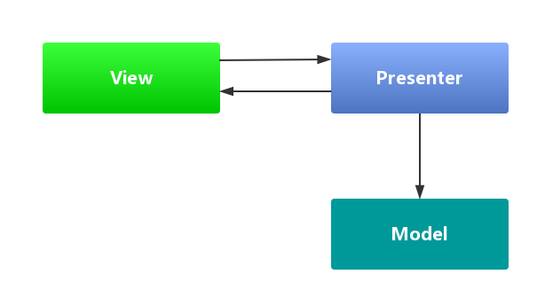

## 1. MVP设计模式

随着UI创建技术的功能日益增强，UI层也履行着越来越多的职责。为了更好地细分视图(View)与模型(Model)的功能，让View专注于处理数据的可视化以及与用户的交互，同时让Model只关系数据的处理，基于MVC概念的MVP(ModelViewPresenter)模式应运而生。

在MVP模式里通常包含4个要素：

- View：负责绘制UI元素、与用户进行交互(在Android中体现为Activity(fragment)，Activity(fragment)只控制界面的数据展示和与用户的交互)
- View interface：需要View实现的接口，View通过View interface与Presenter进行交互，降低耦合，方便进行单元测试
- Model：负责存储、检索、操纵数据(有时也实现一个Model interface用来降低耦合)
- Presenter：作为View与Model交互的中间纽带，处理与用户交互的负责逻辑。

MVP模式可以分离显示层和逻辑层，它们之间通过接口进行通信，降低耦合。MVP能够有效降低View复杂性，避免业务逻辑塞进View中，使得View变成一个混乱的“大泥坑”。

| 意义        | 说明                                    |
| :-------- | :------------------------------------ |
| Model     | 数据的存取，提供数据的存取功能，依然是实体模型               |
| View      | 用户界面，对应于Activity和xml，负责View的绘制以及与用户交互 |
| Presenter | 交互中间人，负责完成View于Model间的交互和业务逻辑         |

利用MVP的设计模型可以把部分的逻辑代码从Fragment和Activity业务的逻辑移出来，在Presenter中持有View（Activity或者Fragment）的引用，然后在Presenter调用View暴露的接口对视图进行操作，这样有利于把视图操作和业务逻辑分开来。MVP能够让Activity成为真正的View而不是View和Controler的合体，Activity只做UI相关的事。但是这个模式还是存在一些不好的地方，比较如说：

- Activity需要实现各种跟UI相关的接口，同时要在Activity中编写大量的事件，然后在事件处理中调用Presenter的业务处理方法，View和Presenter只是互相持有引用并互相做回调,代码不美观。

- 这种模式中，程序的主角是UI，通过UI事件的触发对数据进行处理，更新UI就要考虑线程的问题。而且UI改变后牵扯的逻辑耦合度太高，一旦控件更改（比较TextView 替换 EditText等）牵扯的更新UI的接口就必须得换。

- 复杂的业务同时会导致Presenter层太大，代码臃肿的问题。

切断的View和Model的联系，让View只和Presenter（原Controller）交互，减少在需求变化中需要维护的对象的数量。MVP定义了Presenter和View之间的接口，让一些可以根据已有的接口协议去各自分别独立开发，以此去解决界面需求变化频繁的问题

MVP模式是MVC模式的一个演化版本，MVP全称Model-View-Presenter。目前MVP在Android应用开发中越来越重要了。解耦view和model层

在Android中，业务逻辑和数据存取是紧紧耦合的，很多缺乏经验的开发者很可能会将各种各样的业务逻辑塞进某个Activity、Fragment或者自定义View中，这样会使得这些组件的单个类型臃肿不堪。如果不将具体的业务逻辑抽离出来，当UI变化时，你就需要去原来的View中抽离具体业务逻辑，这必然会很麻烦并且易出错。

对于view层和presenter层的通信，我们是可以通过接口实现的，具体的意思就是说我们的activity，fragment可以去实现实现定义好的接口，而在对应的presenter中通过接口调用方法。

将activity中的业务部分拆分—mvp，使用接口实现view和presenter的通信和隔离，这种方式有一个缺点，就是接口会非常多

将activity中的界面相关内容拆分—mvvm

### 1.1 使用MVP的好处

MVP模式会解除View与Model的耦合，有效的降低View的复杂性。同时又带来了良好的可扩展性、可测试性，保证系统的整洁性和灵活性。

MVP模式可以分离显示层与逻辑层，它们之间通过接口进行通信，降低耦合。理想化的MVP模式可以实现同一份逻辑代码搭配不同的显示界面，因为它们之间并不依赖于具体，而是依赖于抽象。这使得Presenter可以运用于任何实现了View逻辑接口的UI，使之具有更广泛的适用性，保证了灵活度。

让UI界面和数据分离

### 1.2 MVP模式的三个角色

- Presenter – 交互中间人

Presenter主要作为沟通View与Model的桥梁，它从Model层检索数据后，返回给View层，使得View与Model之间没有耦合，也将业务逻辑从View角色上抽离出来。负责完成View于Model间的交互和业务逻辑

- View – 用户界面

View通常是指Activity、Fragment或者某个View控件，它含有一个Presenter成员变量。通常View需要实现一个逻辑接口，将View上的操作转交给Presenter进行实现，最后，Presenter 调用View逻辑接口将结果返回给View元素。对应于Activity和xml，负责View的绘制以及与用户交互

- Model – 数据的存取

Model 角色主要是提供数据的存取功能。Presenter 需要通过Model层存储、获取数据，Model就像一个数据仓库。更直白的说，Model是封装了数据库DAO或者网络获取数据的角色，或者两种数据方式获取的集合。

### 1.3 MVP的实现

角色介绍 :

- User Interface : 用户界面，通过接口抽象函数功能，解除Presenter与具体UI的耦合
- Presenters : 业务逻辑层，作为UI与Model、网络操作的中间人，接触业务逻辑与UI的耦合
- Network : 网络操作层，处理http请求
- Models : 数据的增删改查操作，例如数据库操作
- Database : 数据持久层，SQLite

使用MVP架构模式，将业务逻辑与UI、数据操作隔离开来，保持灵活性，拥抱变化。