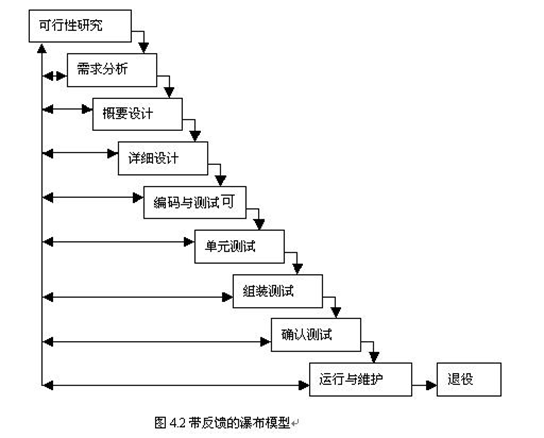
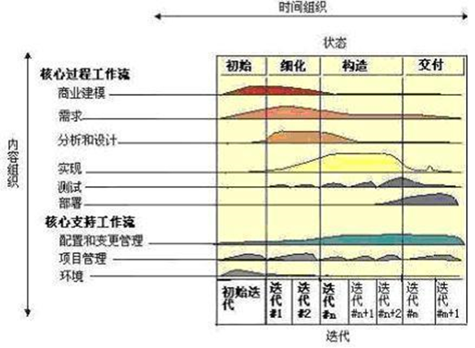

## 软件的生命周期概述

软件生命周期: 软件的产生直到报废的生命周期

软件生命周期内有问题定义, 可行性分析, 总体描述, 系统设计,编码, 调试和测试, 验收与运行, 维护升级到废弃等阶段

随着新的面向对象的设计方法和技术的成熟, 软件生命周期设计方法的指导意义正在逐步减少.

软件工程可以分为三个大的阶段:需求; 设计; 测试与维护

1. 需求: 
   开发目标
   可行性分析 
   需求分析 
2. 设计:
   概要设计
   详细设计
   编码与单元测试 
3. 测试与维护
   综合测试
   维护  

## 软件的生命周期详解

1、问题的定义及规划(可行性分析报告和软件开发计划): 此阶段是软件开发方与需求方共同讨论，主要确定软件的开发目标及其可行性。

2、需求分析(需求分析说明书和初步的用户手册): 在确定软件开发可行的情况下，对软件需要实现的各个功能进行详细分析。需求分析阶段是一个很重要的阶段，这一阶段做得好，将为整个软件开发项目的成功打下良好的基础。

3、软件设计(概要设计、详细设计): 此阶段主要根据需求分析的结果，对整个软件系统进行设计，如系统框架设计，数据库设计等等。软件设计一般分为总体设计和详细设计。

4、程序编码(提交源程序及清单): 此阶段是将软件设计的结果转换成计算机可运行的程序代码。在程序编码中必须要制定统一，符合标准的编写规范。以保证程序的可读性，易维护性，提高程序的运行效率。

5、软件测试(提交软件维护测试报告): 在软件设计完成后要经过严密的测试，以发现软件在整个设计过程中存在的问题并加以纠正。整个测试过程分单元测试（白盒）、集成测试（黑盒，功能测试、强度性能测试）以及系统测试三个阶段进行。测试的方法主要有白盒测试和黑盒测试两种。在测试过程中需要建立详细的测试计划并严格按照测试计划进行测试，以减少测试的随意性。

6、运行维护（提交软件维护报告） : 软件维护是软件生命周期中持续时间最长的阶段。在软件开发完成并投入使后，由于多方面的原因，软件不能继续适应用户的要求。要延续软件的使用寿命，就必须对软件进行维护。软件的维护包括纠错性维护和改进性维护两个方面。

## 软件的生命周期 ---- 瀑布模型

瀑布模型是传统的软件生存周期模式 

瀑布模型的特点是：

1). 各阶段间具有顺序性和依赖性: 后一阶段工作必须在前一阶段工作完成后才能进行。    

2). 质量保证机制的依赖性。即每一步都必须循序渐进，及早消除故障隐患，保证本阶段的工作的质量，从而达到保证整体软件质量的目的。

3). 推迟实现原则。前一阶段工作做的越细, 越扎实，后一阶段工作进行的就越顺利，强调”宁慢求好”。因此，各阶段工作总是一拖再拖，致使整个工期推迟实现。显然瀑布模型不能满足呈爆炸状增长的社会应用需求

## 软件的生命周期 ---- RUP

统一软件开发过程(Rational Unified Process,RUP): 一个通用的软件流程框架, 以架构为中心, 用例驱动的迭代化开发流程. RUP 是从几千个软件项目的实践经验中总结出来的, 对于实际的项目具有很强的指导意义.

RUP 用二维坐标来描述. 横轴通过时间来组织, 是过程展开的生命周期特征, 体现开发过程的动态结构; 纵轴以内容来组织, 体现开发过程的静态结构.

RUP中的构架: 是一种设计的基线. 建造这样的基线采取的策略是, 从用例出发, 寻找那些稳定的,业务意义重大的, 技术风险可以在早期解决的部分, 构建一个可以运行的程序. 以后的开发, 尽量使用以存在的组件 

增量和迭代: 在构建构架的基础上, 添加新的部分, 按照周期性提交最终结果的方式进行开发.

### RUP 中软件生命周期的四个阶段

初始阶段: “获得项目的基础”. 该阶段的主要人员是项目经理和系统设计师. 所要完成的主要任务包括对系统的可行性分析; 创建基本的需求; 识别系统的关键任务.

细化: 主要目标是创建可执行构件基线; 精化风险评估;捕捉大部分的系统功能需求用例; 为构造阶段创建详细需求. 该阶段并不是要创建可执行的系统, 而是展现用户所期望的需求. 

构建: 完成所有的需求, 分析和设计. 该阶段的制品将演化成最终系统

交付: 将完整的系统部署到用户所处的环境中.

### RUP 中的核心工作流 

RUP中有9个核心工作流. 分为6个核心过程工作流(Core Process Workflows) 和 3个核心支持工作流 (Core Supporting Workflows). 尽管6个核心过程工作流类似于传统瀑布模型中的几个阶段, 但迭代过程中的阶段是完全不同的, 这些工作流在项目中轮流被使用, 在每一次迭代中以不同的重点和强度重复.整个生命周期中一次又一次被访问. 9个核心工作流在

### RUP 中的核心工作流(1)

- 商业建模: 理解目标客户的商业结构及商业运作. 为目标系统描述一个构想.
- 需求分析:描述系统应该做什么, 并使开发人员和用户就这一描述达成共识. 
- 分析和设计
- 实现
- 测试
- 部署

### RUP 中的核心工作流(2)

- 配置和变更管理: 对重复工作, 无效的改变进行控制和监视, 以避免由此产生的混乱.跟踪软件创建过程中的版本.
- 项目管理: 平衡各种可能产生冲突, 管理风险, 克服各种约束并成功交付使用户满意的产品
- 环境: 软件开发环境.