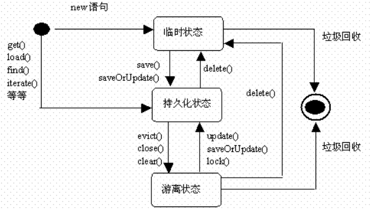

## 状态图

状态图: 通过建立对象的生存周期模型来描述对象随时间变化的动态行为

## 状态图中的基本概念

状态: 用圆角矩形表示. 状态名称表示状态的名字, 通常用字符串表示. 一个状态的名称在状态图所在的上下文中应该是唯一的.

转换: 用带箭头的直线表示. 一端连着源状态, 一端连着目标状态. 

初始状态: 每个状态图都有一个初始状态. 此状态代表状态图的起始位置. 初始状态只能作为转换的源, 不能作为转换的目标, 并且在状态图中只能有一个. 初始状态用一个实心圆表示.

终止状态: 模型元素的最后状态, 是一个状态图的终止点. 终止状态在一个状态图中可以有多个.