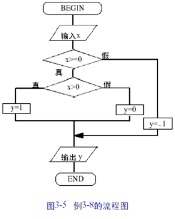
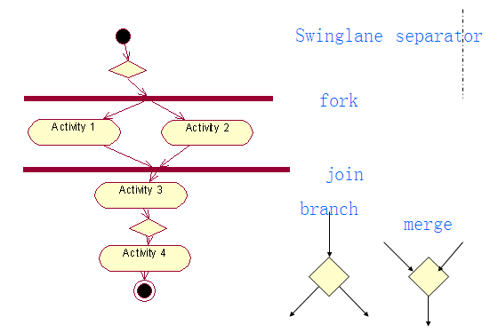
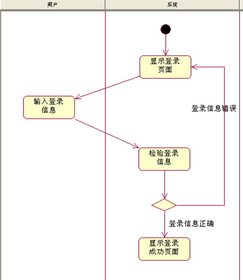
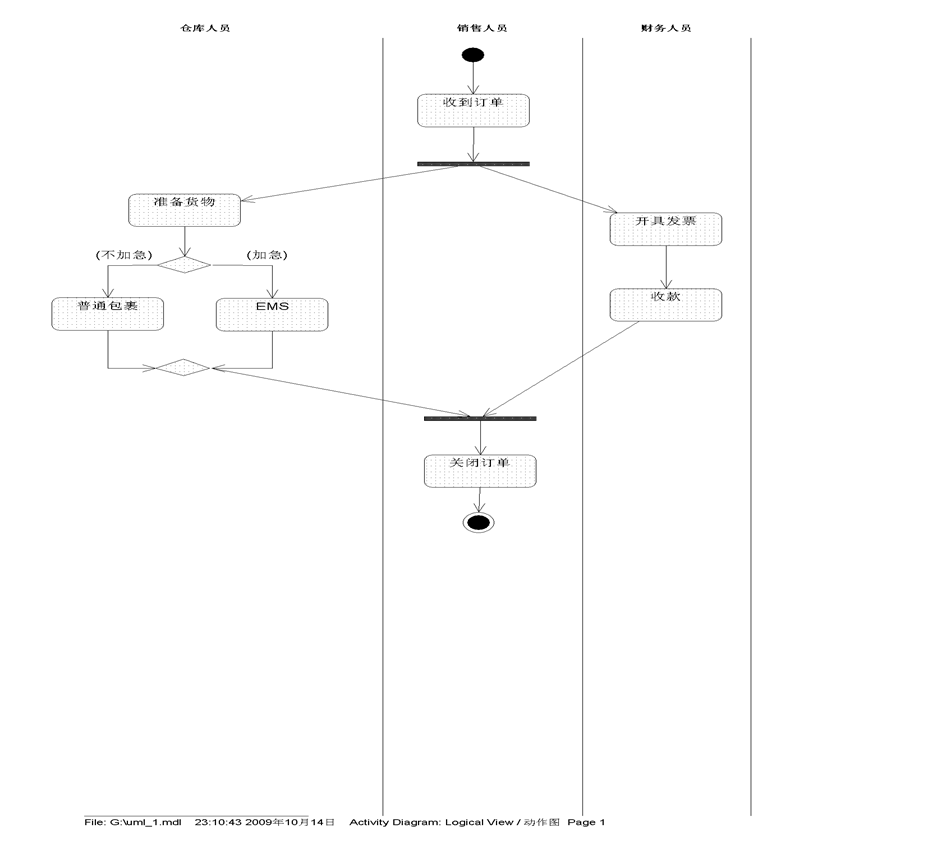

## 活动图

在 UML 中, 活动图本质上就是流程图. 它用于描述系统的活动, 判定点和分支等

### 活动图中的基本概念

动作状态: 原子的, 不可中断的动作, 并在此动作完成之后向另一个动作转变. 在 UML 中动作状态用圆角矩形表示, 动作状态所表示的动作写在圆角矩形内部.

分支与合并:  分支在软件系统中很常见. 一般用于表示对象类所具有的条件行为. 用一个布尔型表达式的真假来判定动作的流向. 条件行为用分支和合并表达.在活动图中, 分支用空心小菱形      表示. 分支包括一个入转换和两个带条件的出转换, 出转换的条件应该是互斥的, 须保证只有一条出转换能够被触发. 合并包含两个带条件的入转换和一个出转换. 

分叉与汇合: 分叉用来描述并发线程, 每个分叉可以有一个输入转换和两个或多个输出转换. 每个转换都可以是独立的控制流. 汇合代表两个或多个并发控制流同步发生, 当所有的控制流都达到汇合点后, 控制才能继续往下进行. 每个汇合可以有两个或多个输入转换和一个输出转换. 在 UML 中分叉和汇合用一条粗直线 表示

泳道: 泳道将活动图中的活动划分为若干组, 并将每一组指定给负责这组活动的业务组织. 泳道区分负责活动的对象, 明确地表示哪些活动是由哪些对象进行的. 每个活动指定明确地属于一个泳道. 在活动图中, 泳道用垂直实线绘出, 垂直线分隔的区域即为泳道 

用户登录活动图

## 活动图练习

某公司销售人员接到订单后, 将订单传给财务人员和仓库人员. 财务人员开具发票, 并收款. 仓库人员准备货物, 并查看是否货物加急, 若是加急采用 EMS 方式发货, 否则采用普通包裹方式发货. 完成之后由销售人员关闭该订单. 根据上面描述画出该公司销售过程的活动图

